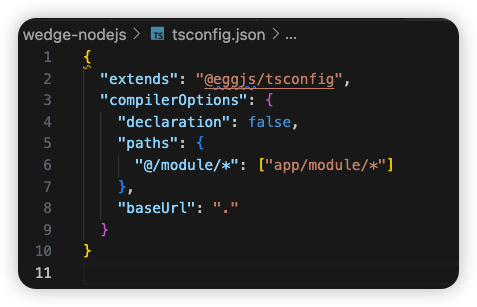

# typescript
参考：https://juejin.cn/post/7174610946713714702
## HOW TO USE
### 1. 设置Typescript
要在Node.js中设置Typescript，你需要Typescript依赖项。要安装Typescript编译器包，请运行以下命令。

```
npm install -g typescript
```
上面的命令将全局安装Typescript编译器。这意味着你在电脑上创建的任何项目都可以访问Typescript依赖项，在构建另一个项目时无需重新安装Typescript包。

运行`tsc --version` 来确认是否安装了编译器。

> 注意：Typescript代码不会直接在浏览器上构建（没有浏览器会直接读取Typescript）。浏览器只会读取JavaScript代码。要调用任何Typescript代码，你需要一个编译器来将Typescript转译为浏览器可执行的JavaScript。Typescript只会在开发过程中帮助你，让你从它的功能中受益。

### 2. 创建一个Typescript配置文件
为了用Node.js初始化Typescript项目，在项目根目录下创建一个tsconfig.json文件。

该配置文件存储了Typescript编译器的选项。另外，你也可以运行tsc --init ，在你所在的任何目录下自动创建这个文件。

tsconfig.json 文件有许多选项。知道什么时候打开和关闭这些选项是很好的。TSC 读取这个文件并使用这些选项将 Typescript 转译为浏览器可读的 JavaScript。

- "target": "es6" - 你需要定义的一个关键事项是编译器将输出的JavaScript的版本。如果你需要更高级的JavaScript功能，如使用箭头函数、 、 ，你可以选择使用ES6或更高版本。目标选项允许你使用并遵循新的JavaScript模式。今天的大多数浏览器只理解es6版本的JavaScript。我们需要告诉Typescript编译器将我们的Typescript代码转译成es6 JavaScript。const let


- "module": "commonjs" - 这是用于结构化和组织JavaScript代码的JavaScript模块格式系统。这使得编译器可以使用模块函数，如 和对象，如 。require() module.exports


- "rootDir": "./src" - 一个存放输入的Typescript文件的目录。我把这个文件夹命名为 。src


- "outDir": "./dist" - 这是一个输出目录，编译后的JavaScript的输出结构将被保存在这里。在这种情况下，JavaScript代码将被保存在主项目根目录下一个名为 的文件夹中。dist


- "moduleResolution": "node" - 一个模块导入解析算法，模仿Node.js实时搜索模块的方式。


- "strict": true - 启用所有的JavaScript严格类型检查选项。


- "esModuleInterop": true - esModuleInterop允许我们将ES6模块编译为commonjs模块。


- "exclude":[] - 告诉Typescript不要编译指定的文件或文件夹。在这种情况下，你可以告诉Typescript不要编译 文件夹，因为它已经安装了Node.js库的JavaScript版本的依赖项。node_modules


这里是一个tsconfig.json 文件选项的例子。
```json
{
  "compilerOptions": {                        
    "target": "es6",                               
    "module": "commonjs",                           
    "outDir": "./dist",                             
    "rootDir": "./src",                             
    "strict": true,
    "moduleResolution": "node",
    "esModuleInterop": true,                       
  },
  "exclude":[
    "./node_modules"
  ]
}
```

注意：在使用Node.js编写Typescript时，一定要确保安装了Node.js类型检查包。
bash复制代码`npm install -D @types/node`

Node.js包是用JavaScript而不是Typescript编写的。为了获得其包的类型定义，你需要安装名为@types 的第三方包。


## ts + egg:
https://www.eggjs.org/tutorials/typescript

```
showcase
├── app
│   ├── controller
│   │   └── home.ts
│   ├── service
│   │   └── news.ts
│   └── router.ts
├── config
│   ├── config.default.ts
│   ├── config.local.ts
│   ├── config.prod.ts
│   └── plugin.ts
├── test
│   └── **/*.test.ts
├── typings
│   └── **/*.d.ts
├── README.md
├── package.json
├── tsconfig.json
└── tslint.json
```