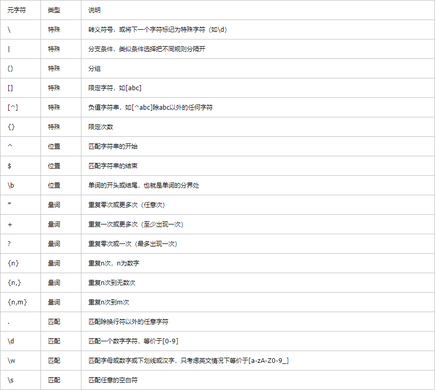

# 正则表达式
> 参考：https://www.wangan.com/wenda/4478
## 基本语法
### 定义
```javascript
const reg1 = /hi/i; // 字面量
const reg2 = new RegExp('hi', 'i') // //构造函数（参数1：最简单的正则匹配字母hi；参数2：表示匹配时不分大小写）

```

### 常用元字符


- 字符转义：
如果需要查找元字符本身，则需要在元字符之前加 \ 进行转义。
```javascript
var reg=/\./;//匹配一个.
var reg=/\\/;// 匹配一个\
```
- 重复：
量词用于限定它前面表达式匹配的次数，有 *+?{} 等。
```javascript
var reg=/\d\d\d/;//匹配3个数字
var reg=/\d*/;//匹配任意数量数字，可能是0个
var reg=/\d+/;//匹配1个到多个数字
var reg=/\d?/;//匹配0到1个数字
var reg=/\d{3}/;//匹配3个数字
var reg=/\d{3,}/;//匹配3到多个数字
var reg=/\d{3,6}/;//匹配3到6个数字
```

- 字符类
在 [] 的范围中添加字符，在中括号内的元字符不需要进行转义‘-’表示至，它的作用为在括号中任选其一。
```javascript
var reg=/[abc]/;//匹配'a','b','c'其中之一
var reg=/[() +\]/;//匹配'(',')',' ','+','\'其中之一,[]内部不需要转义
var reg=/[0-9a-z]/;//匹配0至9和a至z，即[0123456789abcdefghijklmnopqrstuvwxyz]
var reg=/[0-9][a-z]/;//匹配前一个数字后一个字母的两位字符，区别于上述匹配一位字符
```

### JS 中支持正则表达式的 String 对象方法

1、search()

查找：stringObject.search(regexp/str);

该方法用于检索字符串中指定的子字符串，或检索与正则表达式相匹配的字符串，它不执行全局匹配（将忽略标志 g），也没有 regexp 对象的 lastIndex 属性，且总是从字符串开始位置进行查找，总是返回的是 stringObject 匹配的第一个位置
```javascript
var str = "hello"; 
console.log(str.search(/l/)); //2 返回匹配到的第一个位置(使用的regexp对象检索)
console.log(str.search('l')); //2 使用字符串进行匹配
console.log(str.search(/l/g)); //2 没有全局的概念 总是返回匹配到的第一个位置
console.log(str.search(/L/i)); //2 可以忽略大小写来检索
console.log(str.search(/a/)); //-1，如果没有检索到的话，则返回-1
```
2、match()

匹配：stringObject.match(regexp/str)

该方法用于在字符串内检索指定的值，或找到一个或者多个正则表达式的匹配。该方法类似于 indexOf () 或者 lastIndexOf (); 但是它返回的是指定的值，而不是字符串的位置；
```javascript
var str = "hello"; 
console.log(str.match(/e/)); //["e", index: 1, input: "hello"] 返回一个数组，包括匹配到的字符，位置和自身
console.log(str.match('e'));//["e", index: 1, input: "hello"] 支持用字符串代替正则进行匹配
console.log(str.match(/l/g));//["l", "l"]支持全局匹配，返回匹配到的字符组成的数值
```

3、replace()

替换：stringObject.replace(regexp/str,str/function);

该方法用于在字符串中使用一些字符替换另一些字符，或者替换一个与正则表达式匹配的子字符串；默认只替换第一个匹配的字符，可以加修饰符 g 进行全局替换。整体返回替换后的新字符串。
```javascript
var str = "hello world";
console.log(str.replace("hello","a"));// a world，使用字符串匹配并替换
console.log(str.replace(/hello/,"b"));// b world，使用正则匹配并替换
console.log(str.replace(/l/g,""));// heo word，使用正则加装饰符g进行全局替换
console.log(str.replace(/(hello)[ ](\w+)/g,"$2 $1"));// world hello，$1,$2 代表正则中第一个和第二个分组所匹配的文本
//第二个参数是function函数
console.log(str.replace(/o/g,function(v){
  console.log(v);//打印2次o
  return '-';
}));//hell- w-rld，匹配替换为函数的返回值
console.log(str.replace(/(e).*(o)\b/g,function(){
  console.log(arguments);//["ello", "e", "o", 1, "hello world"]
  //第一个匹配的字符，第二和第三是分组匹配的内容，第四是匹配索引位置，第5个是原字符串
  return 'i';
}));// hi world
```

4、split()

分割：stringObject.split(regexp/substr,[length]);

该方法把一个字符串分割成字符串数组，length 设定返回数组的长度即超出部分将被忽略（可选参数）
```javascript
var str = "hello world";
console.log(str.split(" ");//["hello", "world"]，使用字符分割为数组
console.log(str.split(/o/g));//["hell", " w", "rld"]，使用正则匹配的内容来分割
console.log(str.split(/o/g,2));//["hell", " w"]，指定返回数组的length
```


## 常见正则
```javascript

/**
 * @param {string} path
 * @returns {Boolean}
 */
export function isExternal(path) {
  return /^(https?:|mailto:|tel:)/.test(path)
}

/**
 * @param {string} str
 * @returns {Boolean}
 */
export function validUsername(str) {
  const valid_map = ['admin', 'editor']
  return valid_map.indexOf(str.trim()) >= 0
}

/**
 * @param {string} url
 * @returns {Boolean}
 */
export function validURL(url) {
  const reg = /^(https?|ftp):\/\/([a-zA-Z0-9.-]+(:[a-zA-Z0-9.&%$-]+)*@)*((25[0-5]|2[0-4][0-9]|1[0-9]{2}|[1-9][0-9]?)(\.(25[0-5]|2[0-4][0-9]|1[0-9]{2}|[1-9]?[0-9])){3}|([a-zA-Z0-9-]+\.)*[a-zA-Z0-9-]+\.(com|edu|gov|int|mil|net|org|biz|arpa|info|name|pro|aero|coop|museum|[a-zA-Z]{2}))(:[0-9]+)*(\/($|[a-zA-Z0-9.,?'\\+&%$#=~_-]+))*$/
  return reg.test(url)
}

/**
 * @param {string} str
 * @returns {Boolean}
 */
export function validLowerCase(str) {
  const reg = /^[a-z]+$/
  return reg.test(str)
}

/**
 * @param {string} str
 * @returns {Boolean}
 */
export function validUpperCase(str) {
  const reg = /^[A-Z]+$/
  return reg.test(str)
}

/**
 * @param {string} str
 * @returns {Boolean}
 */
export function validAlphabets(str) {
  const reg = /^[A-Za-z]+$/
  return reg.test(str)
}

/**
 * @param {string} email
 * @returns {Boolean}
 */
export function validEmail(email) {
  const reg = /^(([^<>()\[\]\\.,;:\s@"]+(\.[^<>()\[\]\\.,;:\s@"]+)*)|(".+"))@((\[[0-9]{1,3}\.[0-9]{1,3}\.[0-9]{1,3}\.[0-9]{1,3}\])|(([a-zA-Z\-0-9]+\.)+[a-zA-Z]{2,}))$/
  return reg.test(email)
}

/**
 * @param {string} str
 * @returns {Boolean}
 */
export function isString(str) {
  if (typeof str === 'string' || str instanceof String) {
    return true
  }
  return false
}

/**
 * @param {Array} arg
 * @returns {Boolean}
 */
export function isArray(arg) {
  if (typeof Array.isArray === 'undefined') {
    return Object.prototype.toString.call(arg) === '[object Array]'
  }
  return Array.isArray(arg)
}

```