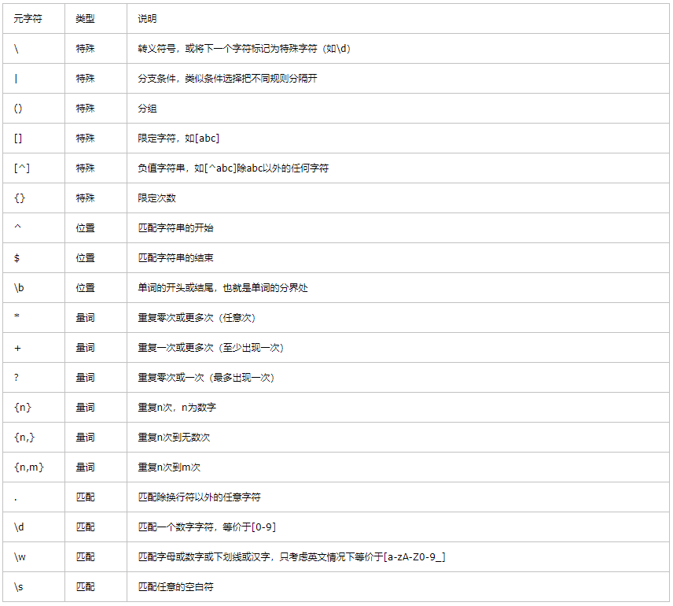

# 正则表达式
> 参考：https://www.wangan.com/wenda/4478
## 基本语法
### 定义
```javascript
const reg1 = /hi/i; // 字面量
const reg2 = new RegExp('hi', 'i') // //构造函数（参数1：最简单的正则匹配字母hi；参数2：表示匹配时不分大小写）

```

### 常用元字符


- 字符转义：
如果需要查找元字符本身，则需要在元字符之前加 \ 进行转义。
```javascript
var reg=/\./;//匹配一个.
var reg=/\\/;// 匹配一个\
```
- 重复：
量词用于限定它前面表达式匹配的次数，有 *+?{} 等。
```javascript
var reg=/\d\d\d/;//匹配3个数字
var reg=/\d*/;//匹配任意数量数字，可能是0个
var reg=/\d+/;//匹配1个到多个数字
var reg=/\d?/;//匹配0到1个数字
var reg=/\d{3}/;//匹配3个数字
var reg=/\d{3,}/;//匹配3到多个数字
var reg=/\d{3,6}/;//匹配3到6个数字
```

- 字符类
在 [] 的范围中添加字符，在中括号内的元字符不需要进行转义‘-’表示至，它的作用为在括号中任选其一。
```javascript
var reg=/[abc]/;//匹配'a','b','c'其中之一
var reg=/[() +\]/;//匹配'(',')',' ','+','\'其中之一,[]内部不需要转义
var reg=/[0-9a-z]/;//匹配0至9和a至z，即[0123456789abcdefghijklmnopqrstuvwxyz]
var reg=/[0-9][a-z]/;//匹配前一个数字后一个字母的两位字符，区别于上述匹配一位字符
```
