# kubernetes
> 参考：https://www.yuque.com/fairy-era/yg511q/vv7qw7#2f7cc0d0


## Namespace
- Namespace是kubernetes系统中一种非常重要的资源，它的主要作用是用来实现==多套系统的资源隔离==或者==多租户的资源隔离==。

- 默认情况下，kubernetes集群中的==所有Pod都是可以相互访问的==。但是在实际中，可能不想让两个Pod之间进行互相的访问，那么此时就可以将两个Pod划分到==不同的Namespace下==。kubernetes通过将集群内部的资源分配到不同的Namespace中，可以形成逻辑上的“组”，以方便不同的组的资源进行隔离使用和管理。

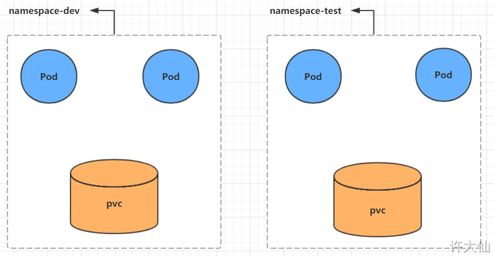

## Pod
- Pod是kubernetes集群进行管理的最小单元，程序要运行必须部署在容器中，而容器必须存在于Pod中。
- Pod可以认为是容器的封装，一个Pod中可以存在一个或多个容器。

### 命令式对象配置
除命令创建外，命令式对象配置
① 新建pod-nginx.yaml：
```yml
apiVersion: v1
kind: Pod
metadata:
  name: nginx
  namespace: dev
  labels:
    version: "3.0"
    env: "test" 
spec:
  containers:
  - image: nginx:1.17.1
    imagePullPolicy: IfNotPresent
    name: pod
    ports: 
    - name: nginx-port
      containerPort: 80
      protocol: TCP

```
② 执行创建和删除命令：
```bash
kubectl create -f pod-nginx.yaml
```

```bash
kubectl delete -f pod-nginx.yaml
```

### Pod的资源清单：
```yml
apiVersion: v1     #必选，版本号，例如v1
kind: Pod       　 #必选，资源类型，例如 Pod
metadata:       　 #必选，元数据
  name: string     #必选，Pod名称
  namespace: string  #Pod所属的命名空间,默认为"default"
  labels:       　　  #自定义标签列表
    - name: string      　          
spec:  #必选，Pod中容器的详细定义
  containers:  #必选，Pod中容器列表
  - name: string   #必选，容器名称
    image: string  #必选，容器的镜像名称
    imagePullPolicy: [ Always|Never|IfNotPresent ]  #获取镜像的策略 
    command: [string]   #容器的启动命令列表，如不指定，使用打包时使用的启动命令
    args: [string]      #容器的启动命令参数列表
    workingDir: string  #容器的工作目录
    volumeMounts:       #挂载到容器内部的存储卷配置
    - name: string      #引用pod定义的共享存储卷的名称，需用volumes[]部分定义的的卷名
      mountPath: string #存储卷在容器内mount的绝对路径，应少于512字符
      readOnly: boolean #是否为只读模式
    ports: #需要暴露的端口库号列表
    - name: string        #端口的名称
      containerPort: int  #容器需要监听的端口号
      hostPort: int       #容器所在主机需要监听的端口号，默认与Container相同
      protocol: string    #端口协议，支持TCP和UDP，默认TCP
    env:   #容器运行前需设置的环境变量列表
    - name: string  #环境变量名称
      value: string #环境变量的值
    resources: #资源限制和请求的设置
      limits:  #资源限制的设置
        cpu: string     #Cpu的限制，单位为core数，将用于docker run --cpu-shares参数
        memory: string  #内存限制，单位可以为Mib/Gib，将用于docker run --memory参数
      requests: #资源请求的设置
        cpu: string    #Cpu请求，容器启动的初始可用数量
        memory: string #内存请求,容器启动的初始可用数量
    lifecycle: #生命周期钩子
		postStart: #容器启动后立即执行此钩子,如果执行失败,会根据重启策略进行重启
		preStop: #容器终止前执行此钩子,无论结果如何,容器都会终止
    livenessProbe:  #对Pod内各容器健康检查的设置，当探测无响应几次后将自动重启该容器
      exec:       　 #对Pod容器内检查方式设置为exec方式
        command: [string]  #exec方式需要制定的命令或脚本
      httpGet:       #对Pod内个容器健康检查方法设置为HttpGet，需要制定Path、port
        path: string
        port: number
        host: string
        scheme: string
        HttpHeaders:
        - name: string
          value: string
      tcpSocket:     #对Pod内个容器健康检查方式设置为tcpSocket方式
         port: number
       initialDelaySeconds: 0       #容器启动完成后首次探测的时间，单位为秒
       timeoutSeconds: 0    　　    #对容器健康检查探测等待响应的超时时间，单位秒，默认1秒
       periodSeconds: 0     　　    #对容器监控检查的定期探测时间设置，单位秒，默认10秒一次
       successThreshold: 0
       failureThreshold: 0
       securityContext:
         privileged: false
  restartPolicy: [Always | Never | OnFailure]  #Pod的重启策略
  nodeName: <string> #设置NodeName表示将该Pod调度到指定到名称的node节点上
  nodeSelector: obeject #设置NodeSelector表示将该Pod调度到包含这个label的node上
  imagePullSecrets: #Pull镜像时使用的secret名称，以key：secretkey格式指定
  - name: string
  hostNetwork: false   #是否使用主机网络模式，默认为false，如果设置为true，表示使用宿主机网络
  volumes:   #在该pod上定义共享存储卷列表
  - name: string    #共享存储卷名称 （volumes类型有很多种）
    emptyDir: {}       #类型为emtyDir的存储卷，与Pod同生命周期的一个临时目录。为空值
    hostPath: string   #类型为hostPath的存储卷，表示挂载Pod所在宿主机的目录
      path: string      　　        #Pod所在宿主机的目录，将被用于同期中mount的目录
    secret:       　　　#类型为secret的存储卷，挂载集群与定义的secret对象到容器内部
      scretname: string  
      items:     
      - key: string
        path: string
    configMap:         #类型为configMap的存储卷，挂载预定义的configMap对象到容器内部
      name: string
      items:
      - key: string
        path: string
```

#### 基本配置
```yml
apiVersion: v1
kind: Pod
metadata:
  name: pod-base
  namespace: dev
  labels:
    user: xudaxian
spec:
  containers:
    - name: nginx # 容器名称
      image: nginx:1.17.1 # 容器需要的镜像地址
    - name: busybox # 容器名称
      image: busybox:1.30 # 容器需要的镜像地址
```
上面定义了一个比较简单的Pod的配置，里面有两个容器：
  ○ nginx：用的是1.17.1版本的nginx镜像创建（nginx是一个轻量级的web容器）。
  ○ busybox：用的是1.30版本的busybox镜像创建（busybox是一个小巧的linux命令集合）。

创建Pod：
```bash
kubectl apply -f pod-base.yaml
```
查看Pod状况：
```bash
kubectl get pod -n dev
```
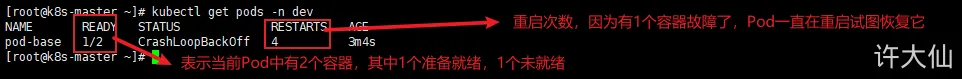


#### imagePullPolicy
> imagePullPolicy：用于设置镜像拉取的策略，kubernetes支持配置三种拉取策略：
  ○ Always：总是从远程仓库拉取镜像（一直远程下载）。
  ○ IfNotPresent：本地有则使用本地镜像，本地没有则从远程仓库拉取镜像（本地有就用本地，本地没有就使用远程下载）。
  ○ Never：只使用本地镜像，从不去远程仓库拉取，本地没有就报错（一直使用本地，没有就报错）。

#### command
> command：用于在Pod中的容器初始化完毕之后执行一个命令。
这里稍微解释下command中的命令的意思：
● "/bin/sh","-c"：使用sh执行命令。
● touch /tmp/hello.txt：创建一个/tmp/hello.txt的文件。
● while true;do /bin/echo $(date +%T) >> /tmp/hello.txt;sleep 3;done：每隔3秒，向文件写入当前时间

#### env环境变量
其中，环境变量（不推荐）
env：环境变量，用于在Pod中的容器设置环境变量。推荐将这些配置单独存储在配置文件中，后面介绍。
```yml
apiVersion: v1
kind: Pod
metadata:
  name: pod-env
  namespace: dev
  labels:
    user: xudaxian
spec:
  containers:
    - name: nginx # 容器名称
      image: nginx:1.17.1 # 容器需要的镜像地址
      imagePullPolicy: IfNotPresent # 设置镜像拉取策略
    - name: busybox # 容器名称
      image: busybox:1.30 # 容器需要的镜像地址
      command: ["/bin/sh","-c","touch /tmp/hello.txt;while true;do /bin/echo $(date +%T) >> /tmp/hello.txt;sleep 3;done;"]
      env:
        - name: "username"
          value: "admin"
        - name: "password"
          value: "123456"
```

#### 资源配额
- 容器中的程序要运行，肯定会占用一定的资源，比如CPU和内存等，如果不对某个容器的资源做限制，那么它就可能吃掉大量的资源，导致其他的容器无法运行。针对这种情况，kubernetes提供了对内存和CPU的资源进行配额的机制，这种机制主要通过resources选项实现，它有两个子选项：
  ○ limits：用于限制运行的容器的最大占用资源，当容器占用资源超过limits时会被终止，并进行重启。
  ○ requests：用于设置容器需要的最小资源，如果环境资源不够，容器将无法启动。
- 可以通过上面的两个选项设置资源的上下限。
- 创建pod-resoures.yaml文件，内容如下：

```yml
apiVersion: v1
kind: Pod
metadata:
  name: pod-resoures
  namespace: dev
  labels:
    user: xudaxian
spec:
  containers:
    - name: nginx # 容器名称
      image: nginx:1.17.1 # 容器需要的镜像地址
      imagePullPolicy: IfNotPresent # 设置镜像拉取策略
      ports: # 端口设置
        - name: nginx-port # 端口名称，如果执行，必须保证name在Pod中是唯一的
          containerPort: 80 # 容器要监听的端口 （0~65536）
          protocol: TCP # 端口协议
      resources: # 资源配额
        limits: # 限制资源的上限
          cpu: "2" # CPU限制，单位是core数
          memory: "10Gi" # 内存限制
        requests: # 限制资源的下限
          cpu: "1" # CPU限制，单位是core数 
          memory: "10Mi" # 内存限制
```

> cpu：core数，可以为整数或小数。
memory：内存大小，可以使用Gi、Mi、G、M等形式。


### Pod的生命周期 和 容器探测
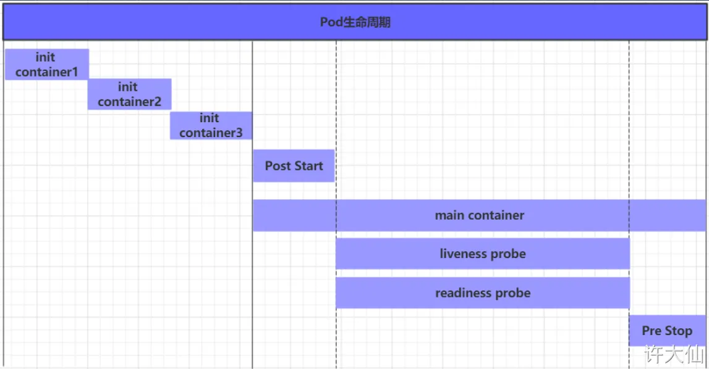
- 我们一般将Pod对象从创建到终止的这段时间范围称为Pod的生命周期，它主要包含下面的过程：
  ○ Pod创建过程。
  ○ 运行初始化容器（init container）过程。
  ○ 运行主容器（main container）：
    ■ 容器启动后钩子（post start）、容器终止前钩子（pre stop）。
    ■ 容器的存活性探测（liveness probe）、就绪性探测（readiness probe）。
  ○ Pod终止过程。

- 容器探测用于检测容器中的应用实例是否正常工作，是保障业务可用性的一种传统机制。如果经过探测，实例的状态不符合预期，那么kubernetes就会把该问题实例“摘除”，不承担业务流量。kubernetes提供了两种探针来实现容器探测，分别是：
  ○ liveness probes：==存活性探测==，用于检测应用实例当前是否处于正常运行状态，如果不是，k8s会重启容器。
  ○ readiness probes：==就绪性探测==，用于检测应用实例是否可以接受请求，如果不能，k8s不会转发流量。


### 亲和性调度
- 虽然定向调度的两种方式，使用起来非常方便，但是也有一定的问题，那就是如果没有满足条件的Node，那么Pod将不会被运行，即使在集群中还有可用的Node列表也不行，这就限制了它的使用场景。
- 基于上面的问题，kubernetes还提供了一种亲和性调度（Affinity）。它在nodeSelector的基础之上进行了扩展，可以通过配置的形式，实现优先选择满足条件的Node进行调度，如果没有，也可以调度到不满足条件的节点上，使得调度更加灵活。
- Affinity主要分为三类：
  ○ nodeAffinity（node亲和性）：以Node为目标，解决Pod可以调度到那些Node的问题。
  ○ podAffinity（pod亲和性）：以Pod为目标，解决Pod可以和那些已存在的Pod部署在同一个拓扑域中的问题。
  ○ podAntiAffinity（pod反亲和性）：以Pod为目标，解决Pod不能和那些已经存在的Pod部署在同一拓扑域中的问题。

关于亲和性和反亲和性的使用场景的说明：
- 亲和性：如果两个应用频繁交互，那么就有必要利用亲和性让两个应用尽可能的靠近，这样可以较少因网络通信而带来的性能损耗。
- 反亲和性：当应用采用多副本部署的时候，那么就有必要利用反亲和性让各个应用实例打散分布在各个Node上，这样可以提高服务的高可用性。


## Label
- Label是kubernetes的一个重要概念。它的作用就是在资源上添加标识，用来对它们进行区分和选择。
- Label的特点：
  ○ 一个Label会以key/value键值对的形式附加到各种对象上，如Node、Pod、Service等。
  ○ 一个资源对象可以定义任意数量的Label，同一个Label也可以被添加到任意数量的资源对象上去。
  ○ Label通常在资源对象定义时确定，当然也可以在对象创建后动态的添加或删除。
- 可以通过Label实现资源的多纬度分组，以便灵活、方便地进行资源分配、调度、配置和部署等管理工作。

- 标签定义完毕之后，还要考虑到标签的选择，这就要用到Label Selector，即：
  ○ Label用于给某个资源对象定义标识。
  ○ Label Selector用于查询和筛选拥有某些标签的资源对象。

> 一些常用的Label标签示例如下：
● 版本标签：“version”:”release”,”version”:”stable”。。。
● 环境标签：“environment”:”dev”,“environment”:”test”,“environment”:”pro”。。。
● 架构标签：“tier”:”frontend”,”tier”:”backend”。。。

> [Sharry]： 不同env可采用不同集群，不会共享资源；或者是不同的Namespace来管理？

## Pod控制器（以ReplicaSet为例）
> ● 在kubernetes中，有很多类型的Pod控制器，每种都有自己的适合的场景，常见的有下面这些：
  ○ ReplicationController：比较原始的Pod控制器，已经被废弃，由ReplicaSet替代。
  ○ ReplicaSet：保证指定数量的Pod运行，并支持Pod数量变更，镜像版本变更。
  ○ Deployment：通过控制ReplicaSet来控制Pod，并支持滚动升级、版本回退。
  ○ Horizontal Pod Autoscaler：可以根据集群负载自动调整Pod的数量，实现削峰填谷。
  ○ DaemonSet：在集群中的指定Node上都运行一个副本，一般用于守护进程类的任务。
  ○ Job：它创建出来的Pod只要完成任务就立即退出，用于执行一次性任务。
  ○ CronJob：它创建的Pod会周期性的执行，用于执行周期性的任务。
  ○ StatefulSet：管理有状态的应用。

- 在这里，需要新了解的配置项就是spec下面几个选项：
  ○ replicas：指定副本数量，其实就是当然rs创建出来的Pod的数量，默认为1.
  ○ selector：选择器，它的作用是建立Pod控制器和Pod之间的关联关系，采用了Label Selector机制（在Pod模块上定义Label，在控制器上定义选择器，就可以表明当前控制器能管理哪些Pod了）。
  ○ template：模板，就是当前控制器创建Pod所使用的模板，里面其实就是前面学过的Pod的定义。

```yml
apiVersion: apps/v1 # 版本号 
kind: ReplicaSet # 类型 
metadata: # 元数据 
  name: # rs名称
  namespace: # 所属命名空间 
  labels: #标签 
    controller: rs 
spec: # 详情描述 
  replicas: 3 # 副本数量 
  selector: # 选择器，通过它指定该控制器管理哪些po
    matchLabels: # Labels匹配规则 
      app: nginx-pod 
    matchExpressions: # Expressions匹配规则 
      - {key: app, operator: In, values: [nginx-pod]} 
template: # 模板，当副本数量不足时，会根据下面的模板创建pod副本 
  metadata: 
    labels: 
      app: nginx-pod 
  spec: 
    containers: 
      - name: nginx 
        image: nginx:1.17.1 
        ports: 
        - containerPort: 80
```
扩缩容: 通过修改replicas


## Deployment（Deploy）

● 在kubernetes中，Pod是最小的控制单元，但是kubernetes很少直接控制Pod，一般都是通过Pod控制器来完成的。
● Pod控制器用于Pod的管理，确保Pod资源符合预期的状态，当Pod的资源出现故障的时候，会尝试进行重启或重建Pod。
● 在kubernetes中Pod控制器的种类有很多，本章节只介绍一种：Deployment。

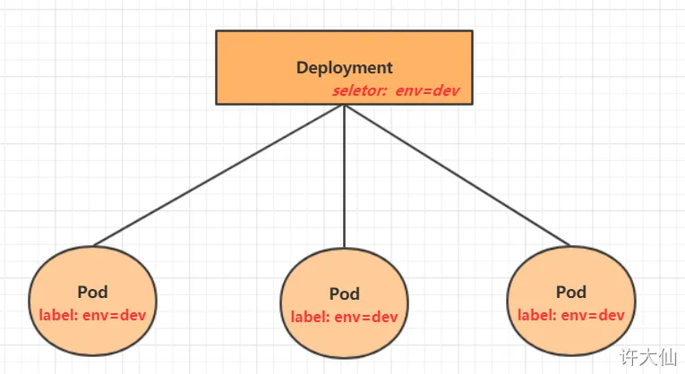

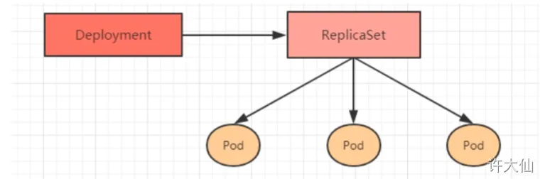
除命令创建外，命令式对象配置：
① 创建一个deploy-nginx.yaml，内容如下：
```yml
apiVersion: apps/v1
kind: Deployment
metadata:
  name: nginx
  namespace: dev
spec:
  replicas: 3 # replicas：指定副本数量，其实就是当然rs创建出来的Pod的数量，默认为1.
  selector: # selector：选择器，它的作用是建立Pod控制器和Pod之间的关联关系，采用了Label Selector机制（在Pod模块上定义Label，在控制器上定义选择器，就可以表明当前控制器能管理哪些Pod了）。
    matchLabels:
      run: nginx
  template: # template：模板，当副本数量不足时，会根据下面的模板创建pod副本，就是当前控制器创建Pod所使用的模板，里面其实就是前面学过的Pod的定义。
    metadata:
      labels:
        run: nginx
    spec:
      containers:
      - image: nginx:1.17.1
        name: nginx
        ports:
        - containerPort: 80
          protocol: TCP
```


## Service
- 我们已经能够利用Deployment来创建一组Pod来提供具有高可用性的服务，虽然每个Pod都会分配一个单独的Pod的IP地址，但是却存在如下的问题：
  ○ Pod的IP会随着Pod的重建产生变化。
  ○ Pod的IP仅仅是集群内部可见的虚拟的IP，外部无法访问。

- 这样对于访问这个服务带来了难度，因此，kubernetes设计了Service来解决这个问题。
- Service可以看做是一组同类的Pod对外的访问接口，借助Service，应用可以方便的实现服务发现和负载均衡。
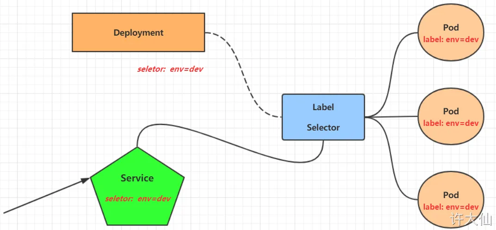

集群外部可访问的Service

- Service在很多情况下只是一个概念，真正起作用的其实是kube-proxy服务进程，每个Node节点上都运行了一个kube-proxy的服务进程。当创建Service的时候会通过API Server向etcd写入创建的Service的信息，而kube-proxy会基于监听的机制发现这种Service的变化，然后它会将最新的Service信息转换为对应的访问规则。

```bash
kubectl expose deployment xxx --name=服务名 --type=NodePort --port=暴露的端口 --target-port=指向集群中的Pod的端口 [-n 命名空间]

# 会产生一个外部也可以访问的Service
```

示例：暴露名为test的namespace下的名为nginx的deployment，并设置服务名为svc-nginx2

```bash
kubectl expose deploy nginx --name=svc-nginx2 --type=NodePort --port=80 --target-port=80 -n test
```


### 资源清单
```yml
apiVersion: v1 # 版本
kind: Service # 类型
metadata: # 元数据
  name: # 资源名称
  namespace: # 命名空间
spec:
  selector: # 标签选择器，用于确定当前Service代理那些Pod
    app: nginx
  type: NodePort # Service的类型，指定Service的访问方式
  clusterIP: # 虚拟服务的IP地址，service的IP地址，如果不写，默认会生成一个
  sessionAffinity: # session亲和性，支持ClientIP、None两个选项，默认值为None
  ports: # 端口信息
    - port: 8080 # Service端口
      protocol: TCP # 协议
      targetPort : # Pod端口
      nodePort:  # 主机端口
```

spec.type的说明：
● ClusterIP：默认值，它是kubernetes系统自动分配的虚拟IP，只能在集群内部访问。
● NodePort：将Service通过指定的Node上的端口暴露给外部，通过此方法，就可以在集群外部访问服务。
● LoadBalancer：使用外接负载均衡器完成到服务的负载分发，注意此模式需要外部云环境的支持。
● ExternalName：把集群外部的服务引入集群内部，直接使用。
==targetPort==: Pod端口


除命令创建外，命令式对象配置：
```yml
apiVersion: v1
kind: Service
metadata:
  name: svc-nginx
  namespace: dev
spec:
  clusterIP: 10.109.179.231 #会产生一个CLUSTER-IP，这个就是service的IP，在Service的生命周期内，这个地址是不会变化
  ports:
  - port: 80
    protocol: TCP
    targetPort: 80
  selector:
    run: nginx
  type: ClusterIP
```

### 使用
首先利用Deployment创建出3个Pod，注意要为Pod设置app=nginx-pod的标签。
创建deployment.yaml文件，内容如下：
```yml
apiVersion: apps/v1
kind: Deployment
metadata:
  name: pc-deployment
  namespace: dev
spec:
  replicas: 3
  selector:
    matchLabels:
      app: nginx-pod
  template:
    metadata:
      labels:
        app: nginx-pod
    spec:
      containers:
        - name: nginx
          image: nginx:1.17.1
          ports:
            - containerPort: 80
```


#### ClusterIP类型的Service
1. 创建Service
```yml
apiVersion: v1
kind: Service
metadata:
  name: service-clusterip
  namespace: dev
spec:
  selector:
    app: nginx-pod
  clusterIP: 10.97.97.97 # service的IP地址，如果不写，默认会生成一个
  type: ClusterIP
  ports:
    - port: 80 # Service的端口
      targetPort: 80 # Pod的端口
```

```bash
kubectl create -f service-clusterip.yaml
```

查看Service：
```bash
kubectl get svc -n dev -o wide
```
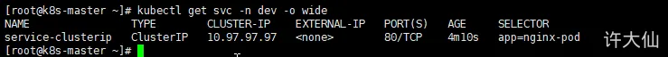

查看Service的详细信息：
```bash
kubectl describe svc service-clusterip -n dev
```
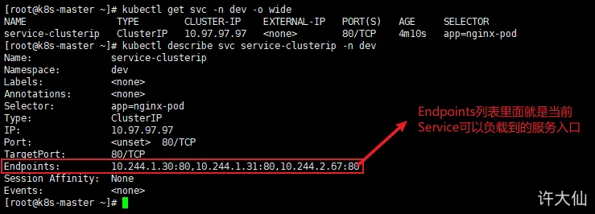

查看ipvs的映射规则
```bash
ipvsadm -Ln
```
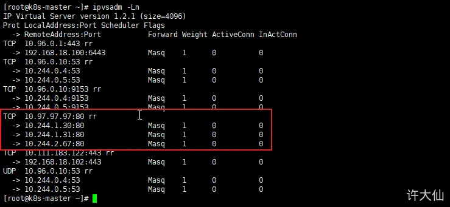

2. 访问10.97.97.97:80，观察效果
```bash
curl 10.97.97.97:80
```
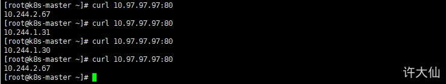

##### 负载分发策略
● 对Service的访问被分发到了后端的Pod上去，目前kubernetes提供了两种负载分发策略：
  ○ 如果不定义，默认使用kube-proxy的策略，比如随机、轮询等。
  ○ 基于客户端地址的会话保持模式，即来自同一个客户端发起的所有请求都会转发到固定的一个Pod上，这对于传统基于Session的认证项目来说很友好，此模式可以在spec中添加sessionAffinity: ClusterIP选项。

查看ipvs的映射规则，rr表示轮询：
```bash
ipvsadm -Ln
```
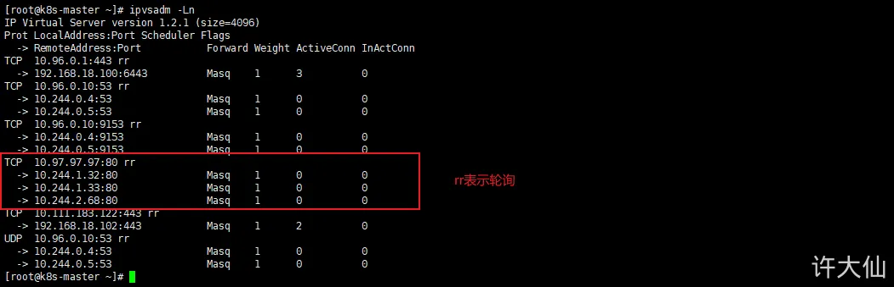

所以上面访问curl 10.97.97.97:80的时候，会有下图的情况：


修改分发策略：
```yml
apiVersion: v1
kind: Service
metadata:
  name: service-clusterip
  namespace: dev
spec:
  selector:
    app: nginx-pod
  clusterIP: 10.97.97.97 # service的IP地址，如果不写，默认会生成一个
  type: ClusterIP
  sessionAffinity: ClientIP # 修改分发策略为基于客户端地址的会话保持模式
  ports:
    - port: 80 # Service的端口
      targetPort: 80 # Pod的端口
```
循环测试访问：
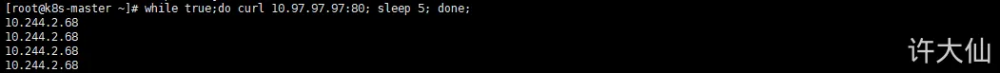

负载均衡其实是通过Pod控制器来实现的，Service其实就是通过Label标签来进行匹配Pod，并对外实现访问的，当Pod挂了，Pod控制器会立即重启一个新的Pod或者根据策略重启Pod，Ingress其实就是动态的Nginx啊

#### NodePort类型的Service

在之前的案例中，==创建的Service的IP地址只能在集群内部才可以访问==，如果希望Service==暴露给集群外部==使用，那么就需要使用到另外一种类型的Service，称为NodePort类型的Service。NodePort的工作原理就是将Service的端口映射到Node的一个端口上，然后就可以通过==NodeIP:NodePort==来访问Service了。
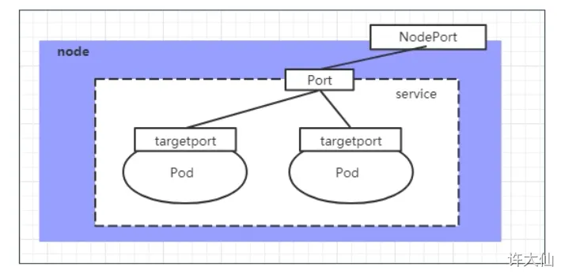

```yml
apiVersion: v1
kind: Service
metadata:
  name: service-nodeport
  namespace: dev
spec:
  selector:
    app: nginx-pod
  type: NodePort # Service类型为NodePort
  ports:
    - port: 80 # Service的端口
      targetPort: 80 # Pod的端口
      nodePort: 30002 # 指定绑定的node的端口（默认取值范围是30000~32767），如果不指定，会默认分配
```

```bash
kubectl create -f service-nodeport.yaml
```
查看Service：
```bash
kubectl get svc service-nodeport -n dev -o wide
```
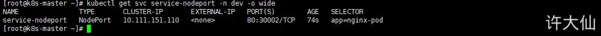

通过浏览器访问：http://192.168.18.100:30002/即可访问对应的Pod。

## 数据存储
● 在前面已经提到，容器的生命周期可能很短，会被频繁的创建和销毁。那么容器在销毁的时候，保存在容器中的数据也会被清除。这种结果对用户来说，在某些情况下是不乐意看到的。为了持久化保存容器中的数据，kubernetes引入了Volume的概念。
● Volume是Pod中能够被多个容器访问的共享目录，它被定义在Pod上，然后被一个Pod里面的多个容器挂载到具体的文件目录下，kubernetes通过Volume实现同一个Pod中不同容器之间的数据共享以及数据的持久化存储。Volume的生命周期不和Pod中的单个容器的生命周期有关，当容器终止或者重启的时候，Volume中的数据也不会丢失。
● kubernetes的Volume支持多种类型，比较常见的有下面的几个：
  ○ 简单存储：EmptyDir、HostPath、NFS。
  ○ 高级存储：PV、PVC。
  ○ 配置存储：ConfigMap、Secret。