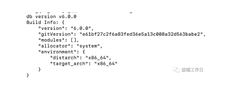
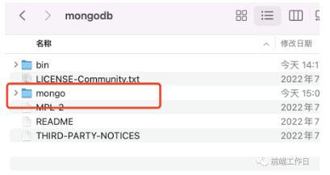

## 安装
### 安装包
https://mp.weixin.qq.com/s/wCIjaQGyy0KjdvHP05_hdg
首先，进入mongodb的官网，我们选择社区版
> https://www.mongodb.com/try/download/community

https://mmbiz.qpic.cn/mmbiz_png/GHGkzMfxLXvicCZy1by0YukWVSAiajmCCHzmwChviapVrRRUujlxOJcCppqpcZoAkf1fKfCkrEstYkgu94RoMmOKA/640?wx_fmt%253Dpng%2526wxfrom%253D13%2526tp%253Dwxpic


下载后的安装包，解压后，放在/usr/local中。
步骤就是打开“访达”，
并把上一步解压后的文件夹放在这个目录，并且重命名mongodb

### 配置环境变量
打开terminal，cd ~
```
open -e .bash_profile
```
输入，
```
open -e .bash_profile
```

如果提示没有该文件，那就新建改文件
```
touch .bash_profile
```

如果创建不成功，前面加sudo ,即
```
sudo touch .bash_profile
```

创建成功之后，
```
open -e .bash_proflile
```

配置环境变量，输入：
```
export PATH=${PATH}:/usr/local/mongodb/bin
```
然后验证适否配置成功，输入 terminal中输入： 
```
mongod -version
```
出现版本号即为安装成功。

如果提示mongodb后因“无法验证卡发者”导致不能启动


也简单，只需要打开安装的mongodb目录下的bin，找到mongod，鼠标右击，选择打开（注意：千万不要直接双击打开）

然后选择同意即可。

### 配置
安装成功之后，并不完，还要在新建三个文件夹，在bin的同级目录下新建mongo文件夹

mongo下新建data、log和config的文件夹
conf文件夹中新建，mongo.conf，在log文件夹新建mongo.log，

其中mongo.conf配置如下：
prot：端口，
dbpath就是数据库的存放地方，
logpath是日志的存放地方，
其中fork可以设置为true，只需开启一次，下次默认开启。
```
port=27017
dbpath=/usr/local/mongodb/mongo/data/
logpath=/usr/local/mongodb/mongo/log/mongo.log
fork=false
```

### 启动
启动mongod：

mongod --config /usr/local/mongodb/mongo/conf/mongo.conf

打开浏览器访问：

http://localhost:27017/
