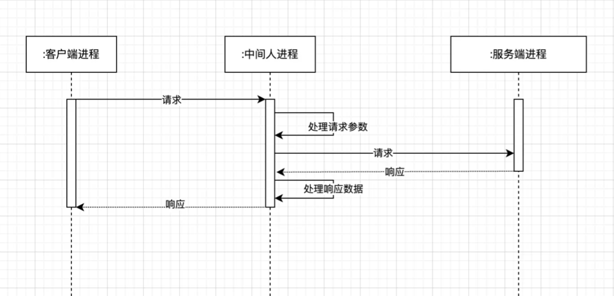
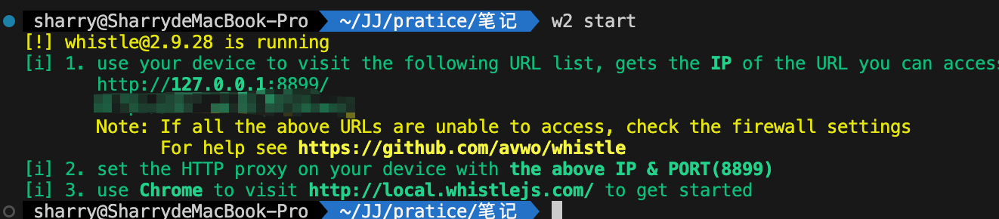
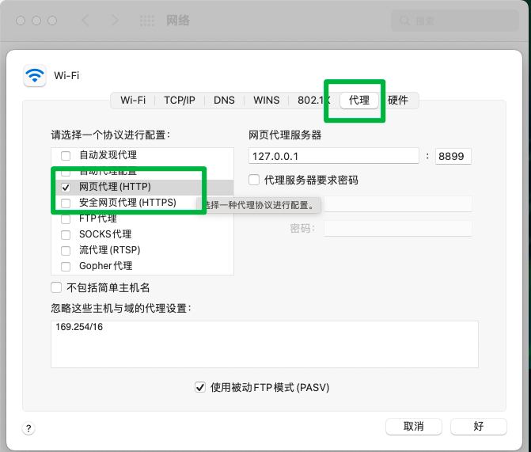
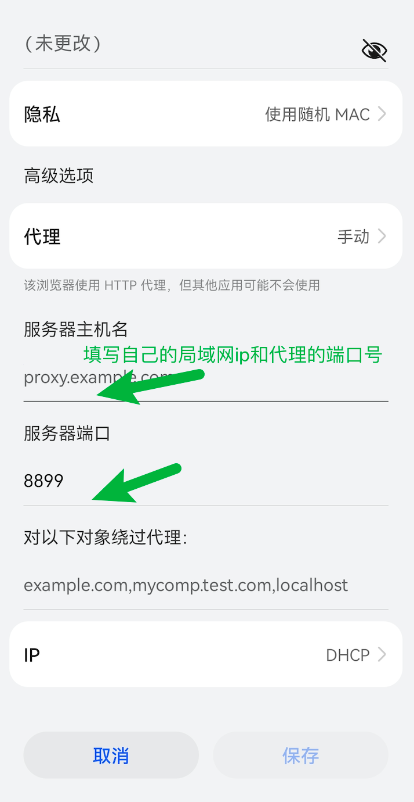
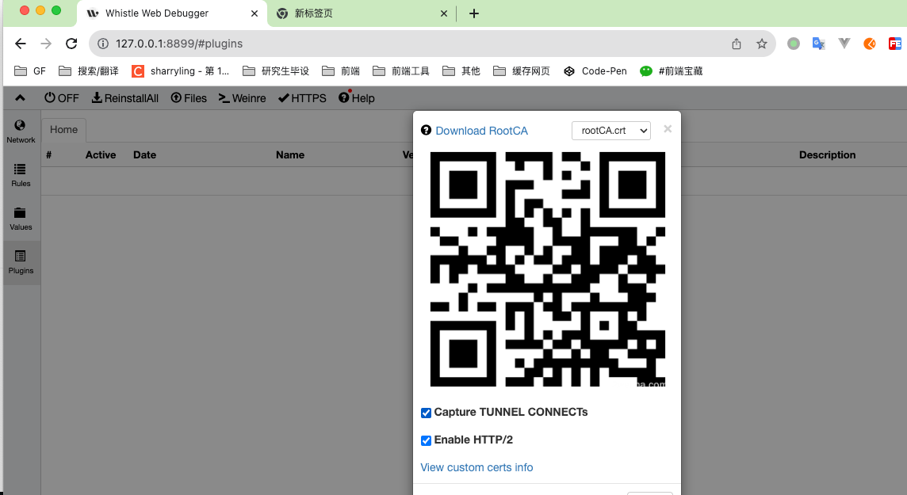
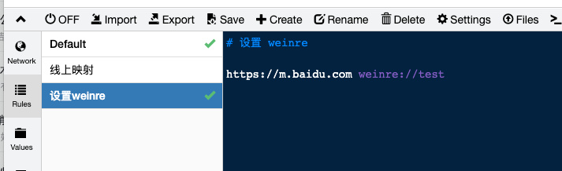
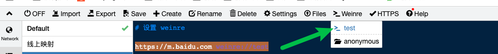
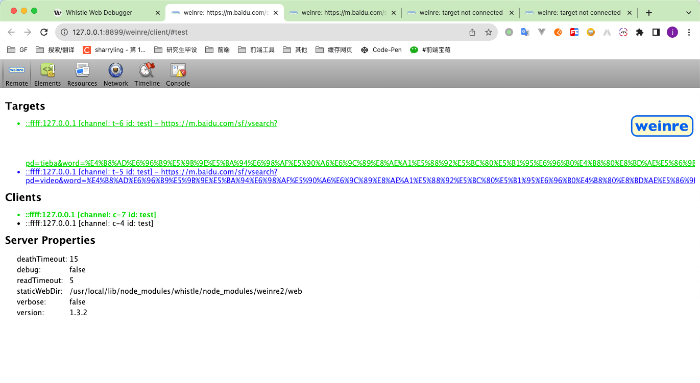
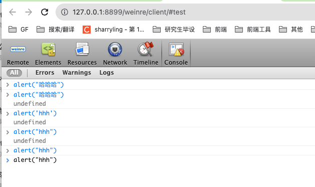
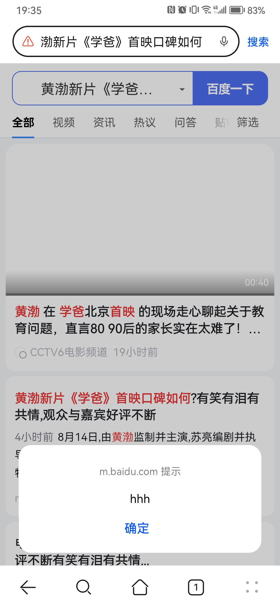

# 什么是抓包
> 引用参考：https://www.uoften.com/article/222272.html

知道了两个进程的通信流程，我们要怎么抓包呢？举一个生活中的例子，小明暗恋小雯，于是他写了一封情书，但他有点害羞，找了小雯的好朋友小花帮忙传递情书。这个时候，小花可以负责小雯与小明之间的情书传递，作为中间人，她可以偷偷查看他们的情书内容。

思路就是设置一个中间人进程负责抓包，每次目标进程之间的会话都先与中间人进程通信，再进行转发。

HTTP 是明文传输，容易受到中间人攻击，不安全。

HTTPS 语义仍然是 HTTP，只不过是在 HTTP 协议栈中 http 与 tcp 之间插入安全层 SSL/TSL。

安全层采用==对称加密的方式加密传输数据和非对称加密的方式来传输对称密钥==，解决 http 数据没有加密、无法验证身份、数据容易纂改三个核心问题。

# whistle
在 PC 电脑本地起一个服务器进程，监听一个端口比如 8899
例如下文中，都是开启了8899端口

# mac如何设置本地代理
除了谷歌浏览器可以使用`Proxy SwitchyOmega`之外，也可以配置全局的代理
系统偏好设置 -> 网络 -> 高级 -> 代理 -> 网页代理

这样，在别的浏览器中也能走代理了

# 手机抓包
## HOW
1. 如果是公司内网，手机需要连接公司内网wifi，处于同一局域网中
2. 手机配置如下：连接wiki时，选择内网wifi，并打开手动代理

填写PC 端 的局域网ip和端口号，例如pc端的whistle开启了8899端口

1. 此时，手机的网络就能抓包在下图，手机上所有的网络通信都会被先转发到 PC 端的 8899 端口，就可以对数据包进行分析处理（若为https，需要勾选“`Capture TUNNEL CONNECTs`”）

> https://www.uoften.com/article/222272.html 事例：
> 在原生 app 上已经通过 h5 域名加载了 web 页面，但是本地开发时不想每次都走流水线或本地打包上传代码。
需要把原生 app 的请求代理到本地服务器上来，前提条件是 wifi 手机与电脑可相互访问，也就是前面提到的电脑抓 pc 的包。
因为我的 web 服务端是 https 应用，因此需要下载 whistle 提供的根证书，手动导入到手机上。
点击 HTTPS 菜单，然后使用手机扫描二维码，使用手机浏览器打开即可下载，在手机证书中设置进行导入并且设置信任。

## 查看移动端的 DOM 样式
Whistle 能够通过内置的 Weinre 去实现查看移动端的 DOM 样式，配置规则如下

# 设置 weinre

https://m.baidu.com weinre://test
手机上重新访问 m.baidu.com 网站，然后打开 weinre 可以看到如下，绿色表示远程连接成功。

可以点击 Element 查看手机上网页 DOM 结构、样式等信息。

也可以在 console 控制台中，执行代码，比如 alert ，手机应用上会显示弹框。

