# 推荐工具

## 关于VSCode 插件

###  自定义命令
> 参考：https://blog.csdn.net/z291493823/article/details/131400324
> https://www.51c51.com/danpianji/xinxi/84/521985.html
在keybindings.json可以配置简单命令
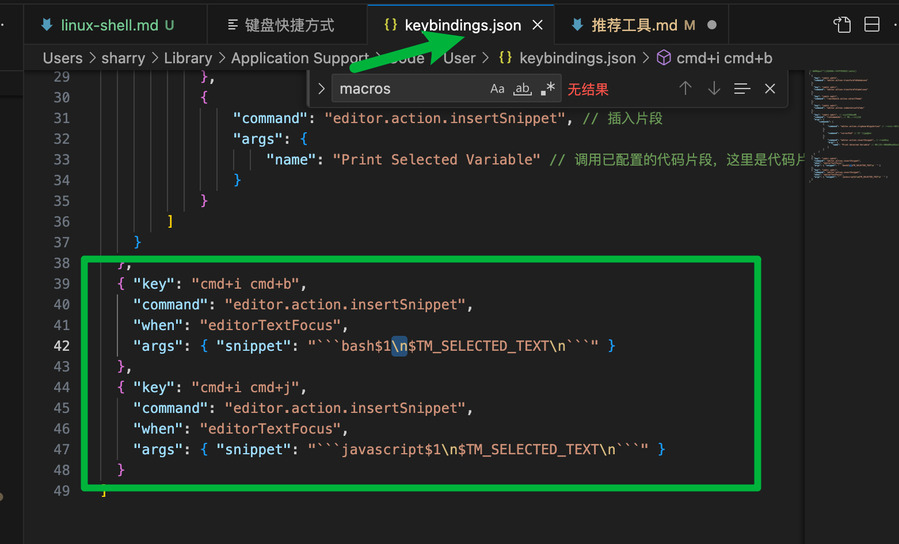
例如：

```json
[
  {
    "key": "cmd+i cmd+l", // 自定义快捷键
    "command": "runCommands", // 运行多个命令
    "args": {
        "commands": [
            {
                "command": "editor.action.clipboardCopyAction" // 复制选中文本
            },
            {
                "command": "cursorEnd" // 光标移到最后
            },
            {
                "command": "editor.action.insertSnippet", // 插入片段
                "args": {
                    "name": "Print Selected Variable" // 调用已配置的代码片段，这里是代码片段里定义的值
                }
            }
        ]
    }
  },
  { 
    "key": "cmd+i cmd+s",
    "command": "editor.action.insertSnippet",
    "when": "editorTextFocus",
    "args": { "snippet": "```bash$1\n$TM_SELECTED_TEXT\n```" }
  },
  { "key": "cmd+i cmd+j",
    "command": "editor.action.insertSnippet",
    "when": "editorTextFocus",
    "args": { "snippet": "```javascript$1\n$TM_SELECTED_TEXT\n```" }
  }
]

```
第一项配置就是可以实现一下功能：选中指后`cmd+i cmd+l`就能自动增加console.log
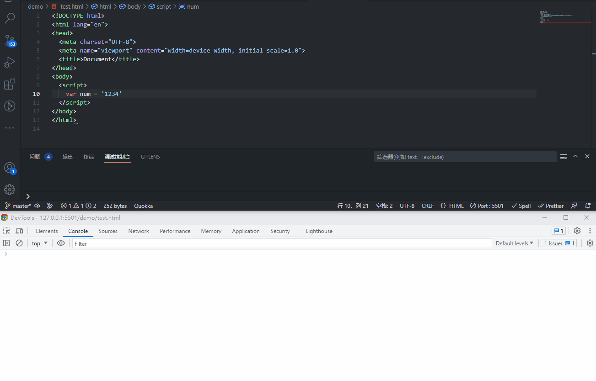

第二/三项配置就是可以实现一下功能：选中指后`cmd+i cmd+s`/`cmd+i cmd+j`可以转成code模块
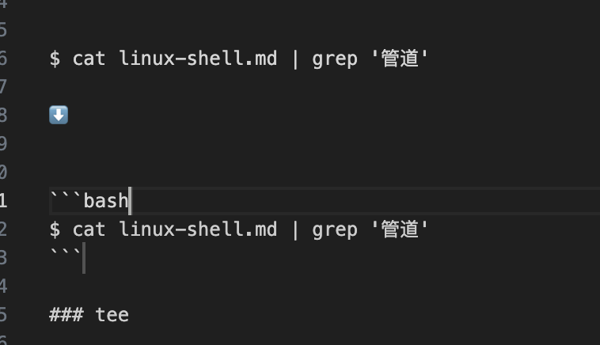

其中第一项的`Print Selected Variable`配置如下：
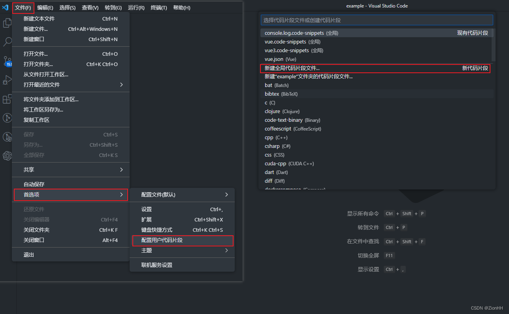
输入一个片段文件名，例如insertCode，然后配置参考如下：
```
{
	"Print Selected Variable": {
		"body": [
			"\nconsole.log(",
			"  '%c $CLIPBOARD: ',",
			"  'background-color: #3756d4; padding: 4px 8px; border-radius: 2px; font-size: 14px; color: #fff; font-weight: 700;',",
			"  $CLIPBOARD$1",
			")"
		],
		"description": "Print Selected Variable"
	},
  "Insert Code Block": {
		"body": [
			"```$1",
			"$CLIPBOARD",
			"```"
		],
		"description": "Insert Code Block"
	},
}
```
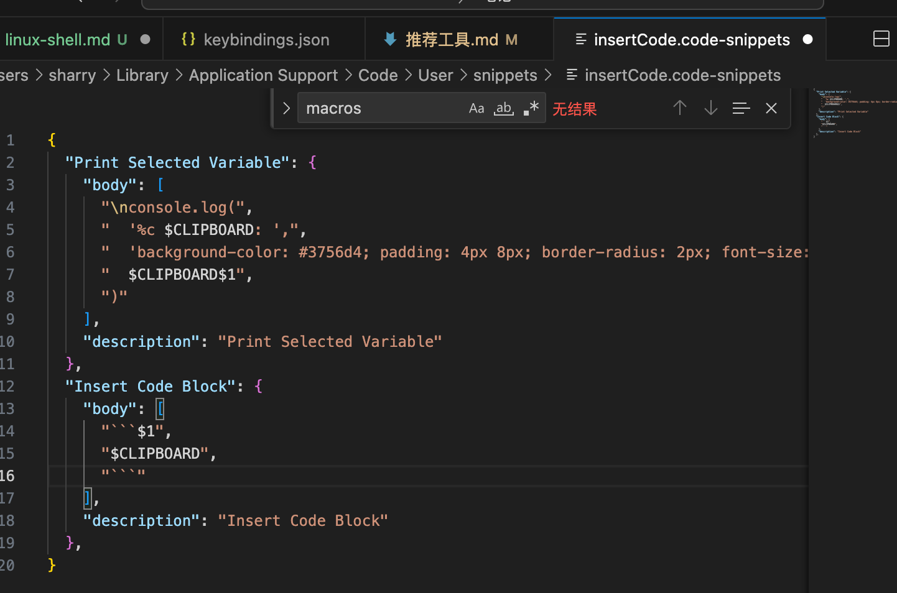

###  Regex Previewer

Regex Previewer 用于测试正则表达式。在编写正则表达式时，可以直接使用快捷键 Ctrl+Alt+M （windows）或者 ⌥+⌘+M（Mac）在编辑器右侧启动一个标签页，可以在这个标签页写一些正则表达式测试用例，写完之后，点击正则表达式上方的 Test Regex...，这时右侧标签页匹配到字符就会高亮显示：


### Code Spell Checker
检查英语单词拼写


### Git Graph


### Paste Image
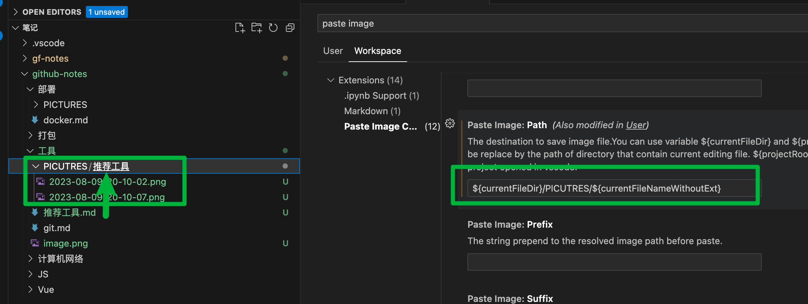
可通过mac：option+command+V 粘贴

```json
{
  "pasteImage.path": "${currentFileDir}/PICTURES/${currentFileNameWithoutExt}"
}
```

### Project Manager
管理项目
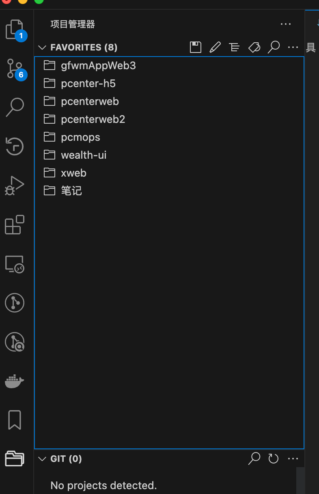


## MAC 工具
> MAC 推荐软件 ：xclient.info

### Transmit: FTP可视化软件

### Alfred：搜索
 Alfred：快捷键
空格 xx 打开
open xxx 打开所在文件夹
bd xxx 搜索百度
gg xxx 谷歌
kaifa xxx 开发者搜索
in: 查找文本文件内含有查询文字的文件

### snipaste：截图软件

### 堡垒机/远程桌面工具 microsoft remote desktop
https://learn.microsoft.com/en-us/windows-server/remote/remote-desktop-services/clients/remote-desktop-mac#get-the-remote-desktop-client

### ColorSlurp 取色器


## 快捷键
电脑：
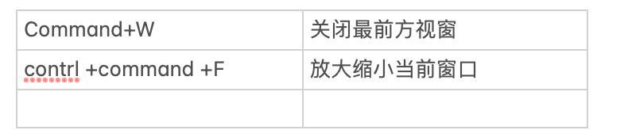


终端命令行快捷键：


1. 增加命令行缩写：
```
vim ~/.bashrc
```
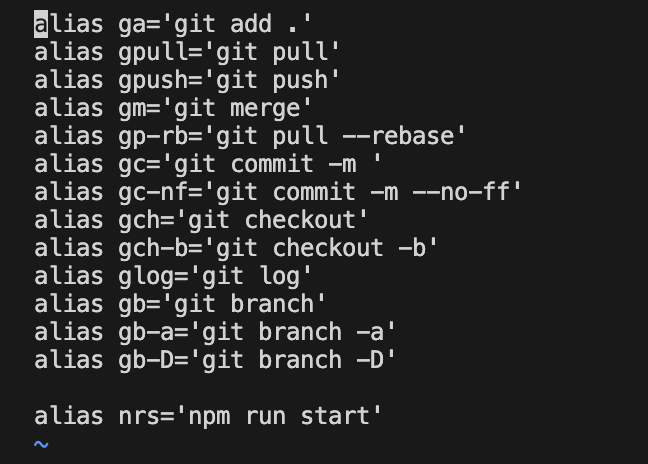

2. source ~/.bashrc  跑起来


## 如何打开多个版本的谷歌
> 旧版本 https://vikyd.github.io/download-chromium-history-version/#/

1. 选择，并下载
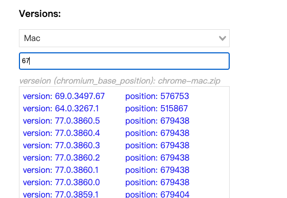
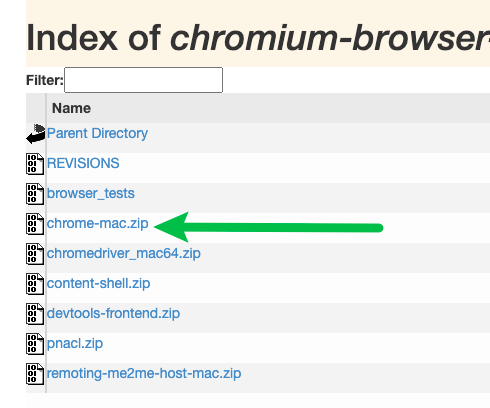
此时双击会报安全问题
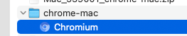

可右键点击打开，选择继续打开
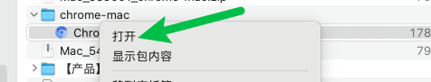
