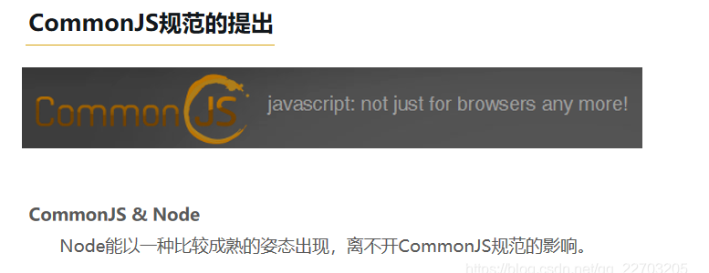

# 模块化开发

> 参考文档：
> 1. https://doc.houdunren.com/%E7%B3%BB%E7%BB%9F%E8%AF%BE%E7%A8%8B/js/13%20%E6%A8%A1%E5%9D%97%E8%AE%BE%E8%AE%A1.html#%E6%A8%A1%E5%9D%97%E8%AE%BE%E8%AE%A1
> 2. [我的总结](https://blog.csdn.net/qq_22703205/article/details/101304441?ops_request_misc=%257B%2522request%255Fid%2522%253A%2522165159368416782425176550%2522%252C%2522scm%2522%253A%252220140713.130102334.pc%255Fblog.%2522%257D&request_id=165159368416782425176550&biz_id=0&utm_medium=distribute.pc_search_result.none-task-blog-2~blog~first_rank_ecpm_v1~rank_v31_ecpm-1-101304441.article_score_rank_blog&utm_term=%E6%A8%A1%E5%9D%97%E5%8C%96&spm=1018.2226.3001.4450) ！！！

## 什么是模块化开发

项目变大时需要把不同的业务分割成多个文件，这就是模块的思想。模块是比对象与函数更大的单元，使用模块组织程序便于维护与扩展。

生产环境中一般使用打包工具如 `webpack` 构建，他提供更多的功能。但学习完本章节后会再学习打包工具会变得简单。

- **模块就是一个独立的文件**，里面是函数或者类库
- 虽然JS没有命名空间的概念，使用模块可以解决全局变量冲突
- 模块需要隐藏内部实现，只对外开发接口
- 模块可以避免滥用全局变量，造成代码不可控
- 模块可以被不同的应用使用，提高编码效率


## AMD/CMD/UMD/COMMONJS/ES6

在过去 JS 不支持模块时我们使用`AMD/CMD（浏览器端使用）`、`CommonJS（Node.js使用）`、`UMD(两者都支持)`等形式定义模块。

参考[我的总结](https://blog.csdn.net/qq_22703205/article/details/101304441?ops_request_misc=%257B%2522request%255Fid%2522%253A%2522165159368416782425176550%2522%252C%2522scm%2522%253A%252220140713.130102334.pc%255Fblog.%2522%257D&request_id=165159368416782425176550&biz_id=0&utm_medium=distribute.pc_search_result.none-task-blog-2~blog~first_rank_ecpm_v1~rank_v31_ecpm-1-101304441.article_score_rank_blog&utm_term=%E6%A8%A1%E5%9D%97%E5%8C%96&spm=1018.2226.3001.4450)：CommonJs用在服务器端，AMD和CMD用在浏览器环境


AMD 代表性的是 require.js，CMD 代表是淘宝的 seaJS 框架。

### 萌芽历程


### CommonJS提出

CommonJS的提出主要是弥补当时js没有标准的缺陷，不应只是停留在小脚本程序阶段。他们期望那些用CommonJS API 写出的应用可以具备跨宿主环境执行的能力。




> module.exports / exports 和 require 配合使用

#### Node.js引入模块流程


【核心模块的优先级仅次于缓存加载，且再Node的源代码编译过程中已经编译为二进制代码，加载过程最快。】


#### require和module的原理
【require 并不是全局性命令，而是每个模块提供的一个内部方法，也就是说，只有在模块内部才能使用 require 命令（唯一的例外是 REPL 环境）。另外，require 其实内部调用 Module._load 方法。】

【大概看了Module.js的源码，整理了一下require方法的实现逻辑。】


### AMD出现

浏览器过程：


commonjs是一种"同步加载"。但是，对于浏览器，这却是一个大问题，因为模块都放在服务器端，等待时间取决于网速的快慢，可能要等很长时间，浏览器处于"假死"状态。=》〉AMD出现，模块的加载不影响它后面语句的运行。所有依赖这个模块的语句，都定义在一个回调函数中，等到加载完成之后，这个回调函数才会运行。

AMD通过`define`方法定义模块：

```
 define(id?, dependencies?, factory);
```

并且采用`require()`语句加载模块：

```
require([module], callback);
```


【AMD:是将所有文件同时加载,一次性引入,推崇依赖前置,也就是在定义模块时要先声明其依赖的模块,加载完模块后会立马执行该模块(运行时加载)】


### CMD
【通过对 RequireJS 的分析我们发现一个问题，就是在用 RequireJS 声明一个模块时要提前指定所有的依赖，这些依赖项会被当做形参传到 define() 方法中，这加大了开发的难度，因为依赖的模块会优先全部加载，那么在阅读代码的时候要先把依赖模块都阅读一次（因为这些依赖模块是初始化的时候执行的）。偷懒是开发者提高效率的初衷，那么如果可以在业务代码中使用到依赖模块的时候再去加载该模块这样就不必提前阅读全部依赖模块代码了。这样 Sea.js 就出现了，在使用上可以理解 Sea.js 是 CommonJS 和 AMD 的结合。】


CMD：代表作seaJS，就近加载资源，用到require，按需引入,推崇依赖就近

在CMD规范中，一个模块就是一个文件。模块定义使用`define`关键字，定义方法如下：

```
define(factory);
```

`define` 是一个全局函数，这个方法接受一个参数，即：要定义的模块factory

1. `factory` 可以是一个函数，也可以是一个对象或字符串。
2. `factory` 为函数时，表示是模块的构造方法，该方法有三个参数，参数依次是：require、exports 和 module。执行该构造方法，可以得到模块向外提供的接口。
3. `factory` 为非函数时，表示模块的接口就是该对象。

在模块定义时会传入三个变量，分别是：require、exports 和 module。

```
define(function(require, exports, module) {

  // 这里是模块的代码

});
```

```tsx
define(function(require, exports, module) {
       var a = require('./a')
       const res = a.doSomething() // 此处略去 100 行
       var b = require('./b') // 依赖可以就近书写
       b.doSomething() // ... 
  
    var jquery = require('./jquery'); 
    exports 或者module.exports导出
  exports.res =  res
  module.exports = res
})
```

define使用类似commonjs的语法，module.exports/exports。相比AMD，更接近commonjs，需要依赖时随时调用require()


### AMD vs CmD

CMD 推崇依赖就近，AMD 推崇依赖前置

AMD：代表作requireJS，依赖前置，依赖全部先在define中定义加载好。文件并行加载。模块的加载不影响它后面语句的运行。所有依赖这个模块的语句，都定义在一个回调函数中，等到加载完成之后，这个回调函数才会运行。

```js
define(['jquery'], function(jquery){ // 工厂函数
    function myFunc(){};
      // 依赖必须一开始就写好 
    return myFunc;
})

define(["a", "b", "c", "d", "e", "f"], function(a, b, c, d, e, f) { 
    // 等于在最前面声明并初始化了要用到的所有模块
    if (false) {
      // 即便没用到某个模块 b，但 b 还是提前执行了。**这就CMD要优化的地方**
      b.foo()
    } 
});
```

define直接return

使用上：

```js
//index.js
require(['./content.js'], function(animal){
    console.log(animal);   //A cat
}
```


### umd 


- > UMD（Universal Module Definition）是`AMD 和 CommonJS 的糅合` ，跨平台的解决方案

- UMD 打包出来的文件可以直接通过==script 插件 html 中使用==

- 我们的代码会被这样一段代码包裹起来

- 既能用script，又能用npm

```javascript
(function (global, factory) {
    typeof exports === 'object' && typeof module !== 'undefined' ? module.exports = factory() :
    typeof define === 'function' && define.amd ? define(factory) :
    (global.libName = factory());
}(this, (function () { 'use strict';})));

```
根据当前运行环境的判断，如果是 Node 环境 就是使用 CommonJS 规范， 如果不是就判断是否为 AMD 环境， 最后导出全局变量。这样代码可以同时运行在Node和浏览器环境中


### ES6

- 形式一： type="module"

type="module"时，是异步加载，相当于script 加了defer，但也略有不同：
当script 不加type时默认是text/javascript模式


- 形式二： import / export / export default


#### ES6的静态编译

【ES6模块的设计思想是尽量的静态化，使得编译时就能确定模块的依赖关系，以及输入和输出的变量(如果你的模块在运行过程中修改了导出的变量值，就会反映到使用模块的代码中去。所以，不推荐在模块中修改导出值，导出的变量应该是静态的。)

`Tree shaking`是基于`ES6`模板语法（`import`与`exports`），主要是借助`ES6`模块的静态编译思想，**在编译时就能确定模块的依赖关系，以及输入和输出的变量**

`Tree shaking`无非就是做了两件事：

- 编译阶段利用`ES6 Module`判断哪些模块已经加载
- 判断那些模块和变量未被使用或者引用，进而删除对应代码


==ES6 模块依赖关系是确定的，和运行时的状态无关，可以进行可靠的静态分析，这就是 tree-shaking 的基础。==


### COMMONJS VS ES6


- CommonJS模块使用require和module.exports语法进行模块的导入和导出
- commonjs 是动态加载；输出的是值的拷贝，是同步加载
  
==commonjs是一种"同步加载"==，这对服务器端不是一个问题，因为所有的模块都存放在本地硬盘，可以同步加载完成，等待时间就是硬盘的读取时间。它是“==运行时”加载的==，同步加载不是问题！commonjs 模块在引入时就已经运行了。


当使用require命令加载某个模块时，就会运行整个模块的代码。当使用require命令加载同一个模块时，不会再执行该模块，而是取到缓存之中的值。也就是说，CommonJS模块无论加载多少次，都只会在第一次加载时运行一次，以后再加载，就返回第一次运行的结果，除非手动清除系统缓存。该对象只有在脚本运行结束时才会生成。

- ES6 是静态加载；输出的是值的引用
- ES6模块使用import和export语法进行模块的导入和导出
  
但 es6 模块在引入时并不会立即执行，内核只是对其进行了引用，==只有在真正用到时才会被执行==，这就是“编译时”加载（引擎在编译代码时建立引用）。

而ES6模块不是对象，它的对外接口只是一种静态定义，在代码静态解析阶段就会生成。


JS引擎对脚本静态分析的时候，遇到模块加载命令import就会**生成一个只读引用**，并不会立即执行。等到脚本真正执行的时候，再根据这个只读引用到被加载的模块中取值。因此，ES6模块是动态引用，动态地去被加载的模块取值，**并且不会缓存值**，模块里的变量绑定其所在的模块。

==所以，commonjs输出的是值的拷贝，ES6是值的引用。==


此外：


## webpack 打包
> 参考链接：https://juejin.cn/post/6844903802382860296

### 为什么webpack项目中，又可以使用es6模块又可以使用commonjs模块？ 

===》〉》 webpack对于ES模块/CommonJS模块的实现，是基于自己实现的webpack_require，所以代码能跑在浏览器中。

已经内置了对 ES6、CommonJS、AMD 模块化语句的支持。在webpack中可以同时使用ES6模块和CommonJS模块。因为 module.exports很像export default，所以ES6模块可以很方便兼容 CommonJS：import XXX from 'commonjs-module'。反过来CommonJS兼容ES6模块，需要额外加上default：require('es-module').default。

Webpack支持两种模块的使用，可以通过配置来确定使用哪种模块规范。

要使用ES6模块，需要在webpack配置文件中使用babel-loader来加载和转译ES6代码，并将模块的output配置设置为ES6模块。

要使用CommonJS模块，可以直接使用webpack默认的配置，无需其他额外的配置。


既然模块规范有这么多，那webpack是如何去解析不同的模块呢？
webpack根据webpack.config.js中的入口文件，在入口文件里识别模块依赖，不管这里的模块依赖是用CommonJS写的，还是ES6 Module规范写的，webpack会自动进行分析，并通过转换、编译代码，打包成最终的文件。**最终文件中的模块实现是基于webpack自己实现的webpack_require（es5代码）**，所以打包后的文件可以跑在浏览器上。
同时以上意味着在webapck环境下，你可以只使用ES6 模块语法书写代码（通常我们都是这么做的），也可以使用CommonJS模块语法，甚至可以两者混合使用。因为从webpack2开始，内置了对ES6、CommonJS、AMD 模块化语句的支持，webpack会对各种模块进行语法分析，并做转换编译。

### 例子

我们举个例子来分析下打包后的源码文件

```javascript
// webpack.config.js
const path = require('path');

module.exports = {
    mode: 'development',
  // JavaScript 执行入口文件
  entry: './src/main.js',
  output: {
    // 把所有依赖的模块合并输出到一个 bundle.js 文件
    filename: 'bundle.js',
    // 输出文件都放到 dist 目录下
    path: path.resolve(__dirname, './dist'),
  }
};

```


```javascript
// src/add
export default function(a, b) {
    let { name } = { name: 'hello world,'} // 这里特意使用了ES6语法
    return name + a + b
}

// src/main.js
import Add from './add'
console.log(Add, Add(1, 2))

```
打包后精简的bundle.js文件如下:

```javascript
// modules是存放所有模块的数组，数组中每个元素存储{ 模块路径: 模块导出代码函数 }
(function(modules) {
// 模块缓存作用，已加载的模块可以不用再重新读取，提升性能
var installedModules = {};

// 关键函数，加载模块代码
// 形式有点像Node的CommonJS模块，但这里是可跑在浏览器上的es5代码
function __webpack_require__(moduleId) {
  // 缓存检查，有则直接从缓存中取得
  if(installedModules[moduleId]) {
    return installedModules[moduleId].exports;
  }
  // 先创建一个空模块，塞入缓存中
  var module = installedModules[moduleId] = {
    i: moduleId,
    l: false, // 标记是否已经加载
    exports: {} // 初始模块为空
  };

  // 把要加载的模块内容，挂载到module.exports上
  modules[moduleId].call(module.exports, module, module.exports, __webpack_require__);
  module.l = true; // 标记为已加载

  // 返回加载的模块，调用方直接调用即可
  return module.exports;
}

// __webpack_require__对象下的r函数
// 在module.exports上定义__esModule为true，表明是一个模块对象
__webpack_require__.r = function(exports) {
  Object.defineProperty(exports, '__esModule', { value: true });
};

// 启动入口模块main.js
return __webpack_require__(__webpack_require__.s = "./src/main.js");
})
({
  // add模块
  "./src/add.js": (function(module, __webpack_exports__, __webpack_require__) {
    // 在module.exports上定义__esModule为true
    __webpack_require__.r(__webpack_exports__);
    // 直接把add模块内容，赋给module.exports.default对象上
    __webpack_exports__["default"] = (function(a, b) {
      let { name } = { name: 'hello world,'}
      return name + a + b
    });
  }),

  // 入口模块
  "./src/main.js": (function(module, __webpack_exports__, __webpack_require__) {
    __webpack_require__.r(__webpack_exports__)
    // 拿到add模块的定义
    // _add__WEBPACK_IMPORTED_MODULE_0__ = module.exports，有点类似require
    var _add__WEBPACK_IMPORTED_MODULE_0__ = __webpack_require__("./src/add.js");
    // add模块内容: _add__WEBPACK_IMPORTED_MODULE_0__["default"]
    console.log(_add__WEBPACK_IMPORTED_MODULE_0__["default"], Object(_add__WEBPACK_IMPORTED_MODULE_0__["default"])(1, 2))
  })
});
```


以上核心代码中，能让打包后的代码直接跑在浏览器中，是因为webpack通过__webpack_require__ 函数模拟了模块的加载（类似于node中的require语法），把定义的模块内容挂载到module.exports上。同时__webpack_require__函数中也对模块缓存做了优化，防止模块二次重新加载，优化性能。

### Webpack ES6语法支持
可能细心的读者看到，以上打包后的add模块代码中依然还是ES6语法，在低端的浏览器中不支持。这是因为没有对应的loader去解析js代码，webpack把所有的资源都视作模块，不同的资源使用不同的loader进行转换。
这里需要使用babel-loader及其插件@babel/preset-env进行处理，把ES6代码转换成可在浏览器中跑的es5代码。


```javascript
// webpack.config.js
module.exports = {
  ...,
  module: {
    rules: [
      {
        // 对以js后缀的文件资源，用babel进行处理
        test: /\.m?js$/,
        exclude: /(node_modules|bower_components)/,
        use: {
          loader: 'babel-loader',
          options: {
            presets: ['@babel/preset-env']
          }
        }
      }
    ]
  }
};
```


```javascript
// 经过babel处理es6语法后的代码
__webpack_exports__["default"] = (function (a, b) {
  var _name = {    name: 'hello world,'  }, name = _name.name;
  return name + a + b;
});
```

### Webpack 模块异步加载-懒加载

以上webpack把所有模块打包到主文件中，所以模块加载方式都是同步方式。但在开发应用过程中，按需加载（也叫懒加载）也是经常使用的优化技巧之一。按需加载，通俗讲就是代码执行到异步模块（模块内容在另外一个js文件中），通过网络请求即时加载对应的异步模块代码，再继续接下去的流程。那webpack是如何执行代码时，判断哪些代码是异步模块呢？webpack又是如何加载异步模块呢？

webpack有个`require.ensure` api语法来标记为异步加载模块，最新的webpack4推荐使用新的==import()== api(需要配合`@babel/plugin-syntax-dynamic-import插件`)。因为require.ensure是通过回调函数执行接下来的流程，而import()返回promise，这意味着可以使用最新的ES8 async/await语法，使得可以像书写同步代码一样，执行异步流程。
现在我们从webpack打包后的源码来看下，webpack是如何实现异步模块加载的。修改入口文件main.js，引入异步模块async.js：


```javascript
// main.js
import Add from './add'
console.log(Add, Add(1, 2), 123)

// 按需加载
// 方式1: require.ensure
// require.ensure([], function(require){
//     var asyncModule = require('./async')
//     console.log(asyncModule.default, 234)
// })

// 方式2: webpack4新的import语法
// 需要加@babel/plugin-syntax-dynamic-import插件
let asyncModuleWarp = async () => await import('./async')
console.log(asyncModuleWarp().default, 234)

```

```javascript
// async.js
export default function() {
    return 'hello, aysnc module'
}
```
以上代码打包会生成两个chunk文件，分别是主文件main.bundle.js以及异步模块文件0.bundle.js。同样，为方便读者快速理解，精简保留主流程代码。

```javascript
// 0.bundle.js

// 异步模块
// window["webpackJsonp"]是连接多个chunk文件的桥梁
// window["webpackJsonp"].push = 主chunk文件.webpackJsonpCallback
(window["webpackJsonp"] = window["webpackJsonp"] || []).push([
  [0], // 异步模块标识chunkId,可判断异步代码是否加载成功
  // 跟同步模块一样，存放了{模块路径：模块内容}
  {
  "./src/async.js": (function(module, __webpack_exports__, __webpack_require__) {
      __webpack_require__.r(__webpack_exports__);
      __webpack_exports__["default"] = (function () {
        return 'hello, aysnc module';
      });
    })
  }
]);
```

以上知道，异步模块打包后的文件中保存着**异步模块源代码**，同时为了区分不同的异步模块，还保存着该异步模块对应的标识：**chunkId**。以上代码主动调用window["webpackJsonp"].push函数，该函数是连接异步模块与主模块的关键函数，该函数定义在主文件中，实际上window["webpackJsonp"].push = webpackJsonpCallback，详细源码咱们看看主文件打包后的代码：
见：https://juejin.cn/post/6844903802382860296

```javascript
// main.bundle.js

(function(modules) {
// 获取到异步chunk代码后的回调函数
// 连接两个模块文件的关键函数
function webpackJsonpCallback(data) {
  var chunkIds = data[0]; //data[0]存放了异步模块对应的chunkId
  var moreModules = data[1]; // data[1]存放了异步模块代码

  // 标记异步模块已加载成功
  var moduleId, chunkId, i = 0, resolves = [];
  for(;i < chunkIds.length; i++) {
    chunkId = chunkIds[i];
    if(installedChunks[chunkId]) {
      resolves.push(installedChunks[chunkId][0]);
    }
    installedChunks[chunkId] = 0;
  }

  // 把异步模块代码都存放到modules中
  // 此时万事俱备，异步代码都已经同步加载到主模块中
  for(moduleId in moreModules) {
    modules[moduleId] = moreModules[moduleId];
  }

  // 重点：执行resolve() = installedChunks[chunkId][0]()返回promise
  while(resolves.length) {
    resolves.shift()();
  }
};

// 记录哪些chunk已加载完成
var installedChunks = {
  "main": 0
};

// __webpack_require__依然是同步读取模块代码作用
function __webpack_require__(moduleId) {
  ...
}

// 加载异步模块
__webpack_require__.e = function requireEnsure(chunkId) {
  // 创建promise
  // 把resolve保存到installedChunks[chunkId]中，等待代码加载好再执行resolve()以返回promise
  var promise = new Promise(function(resolve, reject) {
    installedChunks[chunkId] = [resolve, reject];
  });

  // 通过往head头部插入script标签异步加载到chunk代码
  var script = document.createElement('script');
  script.charset = 'utf-8';
  script.timeout = 120;
  script.src = __webpack_require__.p + "" + ({}[chunkId]||chunkId) + ".bundle.js"
  var onScriptComplete = function (event) {
    var chunk = installedChunks[chunkId];
  };
  script.onerror = script.onload = onScriptComplete;
  document.head.appendChild(script);

  return promise;
};

var jsonpArray = window["webpackJsonp"] = window["webpackJsonp"] || [];
// 关键代码： window["webpackJsonp"].push = webpackJsonpCallback
jsonpArray.push = webpackJsonpCallback;

// 入口执行
return __webpack_require__(__webpack_require__.s = "./src/main.js");
})
({
"./src/add.js": (function(module, __webpack_exports__, __webpack_require__) {...}),

"./src/main.js": (function(module, exports, __webpack_require__) {
  // 同步方式
  var Add = __webpack_require__("./src/add.js").default;
  console.log(Add, Add(1, 2), 123);

  // 异步方式
  var asyncModuleWarp =function () {
    var _ref = _asyncToGenerator( regeneratorRuntime.mark(function _callee() {
      return regeneratorRuntime.wrap(function _callee$(_context) {
        // 执行到异步代码时，会去执行__webpack_require__.e方法
        // __webpack_require__.e其返回promise，表示异步代码都已经加载到主模块了
        // 接下来像同步一样，直接加载模块
        return __webpack_require__.e(0)
              .then(__webpack_require__.bind(null, "./src/async.js"))
      }, _callee);
    }));

    return function asyncModuleWarp() {
      return _ref.apply(this, arguments);
    };
  }();
  console.log(asyncModuleWarp().default, 234)
})
});

```
**通过往head头部插入script标签异步加载到chunk代码**
webpack实现模块的异步加载有点像jsonp的流程。在主js文件中通过在head中构建script标签方式，异步加载模块信息；再使用回调函数webpackJsonpCallback，把异步的模块源码同步到主文件中，所以后续操作异步模块可以像同步模块一样。


> 源码具体实现流程：

1. 遇到异步模块时，使用__webpack_require__.e函数去把异步代码加载进来。该函数会在html的head中动态增加script标签，src指向指定的异步模块存放的文件。
2. 加载的异步模块文件会执行webpackJsonpCallback函数，把异步模块加载到主文件中。
3. 所以后续可以像同步模块一样,直接使用__webpack_require__("./src/async.js")加载异步模块。


> 注意源码中的promise使用非常精妙，主模块加载完成异步模块才resolve()


### 总结

- webpack对于ES模块/CommonJS模块的实现，是基于自己实现的webpack_require，所以代码能跑在浏览器中。
- 从 webpack2 开始，已经内置了对 ES6、CommonJS、AMD 模块化语句的支持。但不包括新的ES6语法转为ES5代码，这部分工作还是留给了babel及其插件。
- 在webpack中可以同时使用ES6模块和CommonJS模块。因为 module.exports很像export default，所以ES6模块可以很方便兼容 CommonJS：import XXX from 'commonjs-module'。反过来CommonJS兼容ES6模块，需要额外加上default：require('es-module').default。
- webpack异步加载模块实现流程跟jsonp基本一致。


## webpack 打包 sdk 例子
> 可参考：https://juejin.cn/post/6859539849972711437
> 代码：[代码demo](https://github.com/sharryling/NOTES-frontEnd/tree/master/demo/%E6%89%93%E5%8C%85sdk)


代码如下：


目的：打包成umd，能够在用npm引入在浏览器和node环境，也可以用script标签引用

本例子以webpack打包为例：
```
yarn add -D webpack@5.0.0-beta.22
yarn add -D webpack-cli
yarn add -D webpack-dev-server
yarn add -D webpack-merge
```

若运行错误： `npm i webpack webpack-cli -g`

在项目中添加以下配置文件: webpack.config.js
```javascript
const {merge} = require('webpack-merge')
const productionConfig = require('./webpack.prod.conf.js') // 引入生产环境配置文件
const developmentConfig = require('./webpack.dev.conf.js') // 引入开发环境配置文件
const webpack = require('webpack')
const path = require('path')

const baseConfig = {
  module: {
    rules: [
      {
        test: /\.(js|ts|tsx)$/,
        exclude: /(node_modules)/,
        use: {
          loader: 'babel-loader',
        },
      },
      {
        test: /\.(less|css)$/,
        use: [
          {
            loader: 'style-loader',
          },
          {
            loader: 'css-loader',
          },
          {
            loader: 'less-loader',
            options: {
              lessOptions: {
                javascriptEnabled: true,
              },
            },
          },
        ],
      },
    ],
  },
  resolve: {
    extensions: ['.ts', '.js', '.tsx', '.jsx'],
    alias: {
      '@': path.resolve(__dirname, './src'),
    },
  },
  plugins: [
    // 使用jsx 按需使用
    new webpack.ProvidePlugin({
      h: ['dom-chef', 'h'],
    }),
  ],
}

module.exports = env => {
  // mode: 'production' || 'development',
  let config = env === 'production' ? productionConfig : developmentConfig
  console.log('当前模式:', env, config)
  return merge(baseConfig, config) // 合并 公共配置 和 环境配置
}

```
其中若包含了有ES6的语法，需要用到babel-loader，编译成浏览器能识别的ES5；若用到less等也需要相应的loader。

引需使用，举例如下：

```
yarn add -D @babel/core
yarn add -D @babel/preset-env
yarn add -D @babel/preset-typescript
yarn add -D @babel/plugin-syntax-typescript
yarn add -D @babel/plugin-transform-react-jsx
```
babel.config.js：
```javascript
const presets = [
  [
    '@babel/preset-env',
    {
      targets: {
        edge: '17',
        firefox: '60',
        chrome: '67',
        safari: '11.1',
        ie: '11',
      },
      useBuiltIns: 'usage',
      corejs: 3,
    },
  ],
  ['@babel/preset-typescript'],
]
const plugins = [
  ['@babel/plugin-syntax-typescript'],
  [
    '@babel/plugin-transform-react-jsx',
    {
      pragma: 'h',
      pragmaFrag: 'DocumentFragment',
    },
  ],
]
module.exports = {presets, plugins}

```

webpack.prod.conf.js 为例：

```javascript
const path = require('path')

module.exports = {
  mode: 'production',
  entry: {
    index: path.resolve(__dirname, './src/app.ts'),
  },
  output: {
    libraryTarget: 'umd',
    path: __dirname + '/dist',
    filename: 'index.js',
    library: 'myFunc',
  },
  performance: {
    hints: 'error',
  },
  plugins: [],
  optimization: {
    minimize: true,
  },
}

```

webpack.dev.conf.js

```javascript
const path = require('path')

module.exports = {
  mode: 'development',
  entry: {
    index: path.resolve(__dirname, './src/app.ts'), //入口
  },
  output: {
    libraryTarget: 'umd',
    path: __dirname + '/dist',
    filename: 'index.js',
    library: 'myFunc',
  },
  devtool: 'source-map',
  performance: {
    hints: 'warning',
  },
}

```

// package.json
```
  "scripts": {
    "build": "webpack"
  },

```

运行`npm run build`

得到/dist/index.js


其中有几个很关键的参数：
libraryTarget： 配置以何种方式导出库；
libraryTarget的取值如下图所示：


==libraryTarget==： 'umd'，打包成umd
==library==： 'myFunc'，声明了一个全局变量，见输出，会将export的结果复制到myFunc作为全局变量，在\<script\>就可以直接用window.myFunc调用

optimization的一些配置：
```
splitChunks: {
  chunks: 'all'
},
usedExports: true, // 配合实现 Tree Shaking，，默认 true 开启
concatenateModules: true, // 公共代码整合，生产环境下被启用
minimize: true, // 在生成环境是否开启js代码压缩和Tree Shaking，默认 true 开启
minimizer: [
  new TerserPlugin({
    extractComments: false, // 当 minimize为true 打包时会生成注释文件，此参数为 false 不生成注释文件，默认：true
  }),
],
```

```html
<!DOCTYPE html>
<html lang="en">
<head>
  <meta charset="UTF-8">
  <meta name="viewport" content="width=device-width, initial-scale=1.0">
  <title>Document</title>
  <script src="./dist/index.js"></script>
  <script src="https://cdnjs.cloudflare.com/ajax/libs/require.js/2.3.2/require.min.js"></script>
</head>
<body>
  <div id="app">内容框</div>
  <script>
    console.log('全局', myFunc);
  </script>
   <script>
    // AMD
      requirejs(['./dist/index.js'], function(func) {
      console.log('func', func);
    });
  </script>
```

结果：


### webpack 如何分包


懒加载也称为延迟加载，其允许你在需要时才去加载某些组件或模块，而不是在应用程序启动时全局加载。这样做可以显著提高应用程序的性能，因为不需要加载所有内容。

懒加载通过分割你的代码包来实现。在进行打包时，webpack会将应用程序拆分成多个包，当你需要某些组件或模块时，它们会动态加载所需的包。这样可以有效减少页面加载的大小，提高整个应用程序的响应速度。


上面的例子，所有的模块都被打包进了dist/index.js，但如果想要拆包：

webpack 执行异步懒加载的代码，在打包时会进行代码分割
webpack 懒加载的方式有两种，一种是通过 CommonJS 规范的 require.ensure()，一种是 ESModel 规范的 import()

src/index.js
```javascript
import funcA from "./funcA";
import funcB from "./funcA";

export default {
  funcA,
  funcB
};
```

```javascript
import dayjs from 'dayjs'
export default function () {
  console.log('我是funcB', dayjs());
}
```
像分别打包，懒加载时导入呢：

`npm run build`打包结果如下：


React的懒加载：


## 运行时 & 编译时

https://blog.lishunyang.com/2021/07/compile-time-and-runtime.html

- 编译过程： 很多人理解 JavaScript 是说它没有编译过程，其实并不是这样。例如，类似 Java, Chrome v8 引擎会先将 js 代码编译成中间码，然后在虚拟机上运行（REPL 环境除外）。由于这个操作不是人为进行的，所以大家都误以为 js 只是解释型的语言。可以查看这篇文章来理解：[Understanding V8’s Bytecode](https://link.zhihu.com/?target=https%3A//medium.com/dailyjs/understanding-v8s-bytecode-317d46c94775)。

compile-time和runtime/编译时和运行时  听上去过于学术了，其实粗略来看，他们最大的区别是**“是否依赖代码的运行”**，就像一辆车，当车静止的时候，你看到的特性都是编译时的，当车跑起来的时候，此时你看到的特性才是运行时的。

所以，“编译时”和“运行时”，通常也对应着“静态”和“动态”。

例如，面试的时候经常被问的一个问题是：

> babel-loader和babel-polyfill的区别是什么？

很多人都能回答上来：babel-loader负责将es6/7/8语法转换成es5，babel-polyfill负责实现一些低版本浏览器没有的API，例如Array.prorotype.includes。

紧接着我会再问一个问题：

> 为什么要分bebel-loader和babel-polyfill呢？能不能合并成一个呢？

到这里就有不少候选人卡住了。对啊，为什么要分两个呢？是因为一个工具只干一件事情吗？不是的。根本的原因就在于他俩一个是作用在编译时，一个是作用在运行时，没法合并呀。

>  ==》〉我理解是，bebel-loader是编译时，polyfill是运行时，运行时才知道if(window.xxx)存不存在？

==静态写法更有利于代码的分析和检查，尽早暴露一些错误，避免上线了运行的时候才发现，从而能够极大地降低开发成本。==


