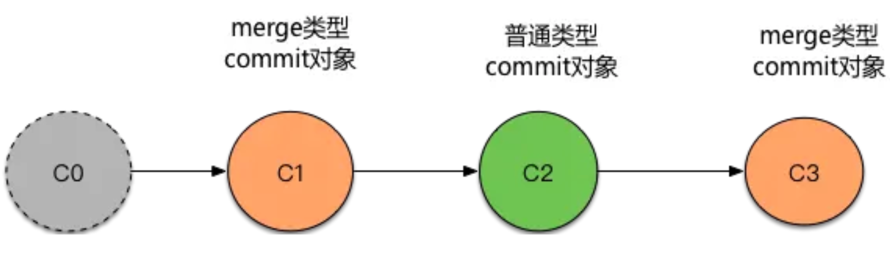

# 玩转Git三剑客
参考：https://b.geekbang.org/member/course/detail/71678

## 不同项目配置不同的 Git 账号
参考：https://segmentfault.com/a/1190000017932264

- 解决
由于电脑上 Github 仓库比较多，所以我将全局 name 和 email 设置成我的 Github 账号。
```
$ git config --global user.name "Linda0821"
$ git config --global user.email "Linda0821@gmail.com"
```
这时打开电脑上任意一个 Git 仓库，输入：
```
$ git config --list
```
都会看到 user.name 和 user.email 用的都是全局的。

然后进入公司项目里，进行特殊设置：
```
$ git config user.name "xiaojia"
$ git config user.email "xiaojia@jd.com"
```

## 最小配置

全局：
```bash
git config --global user.name "your name"
git config --global user.email "your email"
```

```bash
git config --local  # 针对当前仓库有效
git config --global # 针对当前用户所有仓库有效
git config --system # 针对系统所有登录用户有效
```

显示配置：
```bash
git config --list --local 
git config --list --global
git config --list --system
```

## 工作区和暂存区


清楚暂存区：==【危险操作】==
```bash
git reset --hard
```

## 查看日志
```bash
git log 
git log --oneline # 简化日志 [前6个id commit信息]
git log --oneline --graph
git log --oneline --graph --all
git log --oneline --graph --all --decorate
git log -n4 # 显示最近4次提交
```

## 查看分支
```bash
git branch -a # 显示所有分支
git branch -a --merged # 显示所有已合并到当前分支的分支
git branch -a --no-merged # 显示所有未合并到当前分支的分支
git branch -a --merged --no-merged # 显示所有已合并到当前分支的分支和未合并到当前分支的分支
git branch -a --merged --no-merged --all # 显示所有分支
git branch -a --merged --no-merged --all --sort-by-date # 按日期排序
git branch -a --merged --no-merged --all --sort-by-date --reverse # 按日期倒序
git branch -v # 显示本地所有分支的最新一条，即 git branch + git log -n1
```

## 查看命令 git help --web xxx
```bash 
git help --web rebase
```

## 看文件内容/类型
看文件内容
```bash
git cat-file -t xxxxx.xx # 看文件类型
git cat-file -p xxxxx.xx # 看文件内容
```


## .git目录
### HEAD文件: 指向当前的分支


### config 存放配置信息

例如name/email，
可通过 vi ./git/config来修改配置信息，
也可通过命令行方式来修改
```bash
git config user.name "your name"
git config user.email "your email"
```

### refs 目录
  - heads 目录： 存放分支
    - master
      - commitId对象指针，指向了最新的master提交的commit id
    - tmp
      - commitId对象指针，指向了最新的tmp分支提交的commit id
    - ...
  - tags 目录： 存放标签
    - v1.0.0 ...目录方式同heads目录
  - remotes 目录： 存放远程仓库
  - stash 目录： 存放暂存区

- objects 目录： 存放所有数据
  以属性存放commit，这个commitId都是唯一的。
  举例 其中一个commitId的内容
  

### commit、tree和blob三个对象之间的关系
一个commit对应一棵树，这棵树存放了目录，修改的快照；
一个commit对应一个blob，这个blob存放了文件内容，而且**很巧妙地一个文件对应一个blob**，所以在我们重命名文件或其他操作的时候，只要内容相同，就是同一个blob；


## 修改commit
```bash
git commit --amend # 修改最后一次commit
```
若要修改老旧的commit：
1. 先找到commitId，然后通过git rebase -i xxxx来修改
```base
git rebase -i xxxxx # 修改的该commitId
```

可以挑选是哪一种策略，如果要修改：
r -> reword 修改
然后：```:wq``` 保存之后，
就会进入到编辑页


2. d


## 回滚 git revert
原文参考：https://www.cnblogs.com/antball/p/11956043.html

通过git revert来实现线主干代码的回滚。如下命令

对于 merge类型的commit对象，还需要“-m”参数
```bash
git revert -m 1  commit-id
```

对于普通的commit对象
```bash
git revert commit-id
```

### 1 问题描述
一个同事不小把自己代码合并 到了master生成C2。但是在该同事还没有回滚之前，又有其他同事合并到master生成了 C3。现在问题是我们想要回滚到C1应该怎么做？


### 2 解决问题
1、选择git revert还是git reset？

git revert是生成新的commit对象，而git reset是删除commit对象，为了保留记录，使用git revert命令。

2、解决

按时间顺序，依次回滚每一个commit对象，直到自己想要的那个commit对象为准。如下：

回滚C3 ,c3-id是C3对应的那个commit-id
git revert -m  1  c3-id

回滚C2。其中c2-id是C2对应的那个commit-id
git  revert  -m  1  c2-id

3、上面的命令为什么有“-m 1”？

这是因为上面的C2和C3不是普通的commit对象，都是merge生成的commit对象。如下图，如果需要通过git revert回滚M3,那么此时会在M3后面生成一个新的commit节点R，那么这个新节点R是属于M分支（M1->M2->M3->R）还是D分支(D1->D2->D3->R)呢？此时可以通过“-m” 来指定，如果是1，表示的是当前所在的分支，如果是2表示的是另外的分支。


对于上面的问题，由于我们当前分支是master，我们希望revert之后生成的commit也在master这条分支上，所以指定“-m 1”。

这里需要注意的是，如果只是普通的commit 对象，不是merge类型commit对象（由merge产生commit对象），就不需要”-m 1″了


Git 的 revert 命令可以用来撤销提交（commit），对于常规的提交来说，revert 命令十分直观易用，相当于做一次被 revert 的提交的「反操作」并形成一个新的 commit，但是当你需要撤销一个合并（merge）的时候，事情就变得稍微复杂了一些。

Merge Commit
在描述 merge commit 之前，先来简短地描述一下常规的 commit。每当你做了一批操作（增加、修改、或删除）之后，你执行 git commit 便会得到一个常规的 Commit。执行 git show 将会输出详细的增删情况。

Merge commit 则不是这样。每当你使用 git merge 合并两个分支，你将会得到一个新的 merge commit。执行 git show 之后，会有类似的输出：

```bash
commit 19b7d40d2ebefb4236a8ab630f89e4afca6e9dbe
Merge: b0ef24a cca45f9
......
```
其中，Merge 这一行代表的是这个合并 parents，它可以用来表明 merge 操作的线索。

举个例子，通常，我们的稳定代码都在 master 分支，而开发过程使用 dev 分支，当开发完成后，再把 dev 分支 merge 进 master 分支：

```bash
a -> b -> c -> f -- g -> h (master)
           \      /
            d -> e  (dev)
```

上图中，g 是 merge commit，其他的都是常规 commit。g 的两个 parent 分别是 f 和 e。

Revert a Merge Commit
当你使用 git revert 撤销一个 merge commit 时，如果除了 commit 号而不加任何其他参数，git 将会提示错误：

```bash
git revert g
error: Commit g is a merge but no -m option was given.
fatal: revert failed
```
在你合并两个分支并试图撤销时，Git 并不知道你到底需要保留哪一个分支上所做的修改。从 Git 的角度来看，master 分支和 dev 在地位上是完全平等的，只是在 workflow 中，master 被人为约定成了「主分支」。

于是 Git 需要你通过 m 或 mainline 参数来指定「主线」。merge commit 的 parents 一定是在两个不同的线索上，因此可以通过 parent 来表示「主线」。m 参数的值可以是 1 或者 2，对应着 parent 在 merge commit 信息中的顺序。

以上面那张图为例，我们查看 commit g 的内容：

```bash
git show g
commit g
Merge: f e
那么，$ git revert -m 1 g 将会保留 master 分支上的修改，撤销 dev 分支上的修改。

撤销成功之后，Git 将会生成一个新的 Commit，提交历史就成了这样：


a -> b -> c -> f -- g -> h -> G (master)
           \      /
            d -> e  (dev)
```

其中 G 是撤销 g 生成的 commit。通过 $ git show G 之后，我们会发现 G 是一个常规提交，内容就是撤销 merge 时被丢弃的那条线索的所有 commit 的「反操作」的合集。


### 3 问题总结

后续再遇到代码回滚，通过哪些步骤来做呢？这里总结了一些步骤。

1、假设在master上C0后面有C1、C2、C3三次代码提交，此时需要回滚到C0。



2、回滚步骤如下

(1)第一步  切到master代码，使用git log，如下图，获取到每一个commit对象对应的commit-id和commit对象类型（是普通类型还是merge类型）。

```bash
commit ee1389bba4bfcaa0ddb850c6e58d1e982fdfcb4d
  Merge:  8397201  7dc873c
  Author:  jie01  <jie01@qq.com>
  Date: Thu Oct  12  20:27:33  2017  +0800
    Merge branch  'fweb_1-0-806_BRANCH'  into master

commit  2f315650dff28e94d654309ed3230c34d32f1000
  Author:  shan03  <shan03@qq.com>
  Date: Tue Oct  17  14:33:16  2017  +0800

commit  7dc873cd34b8bba1fab68635ddf8331ab2babc74
  Merge:  cbaf7d9 d24f133
  Author:  xu01  <xu01@qq.com>
  Date: Thu Oct  12  15:59:13  2017  +0800
    Merge branch  'web_1-0-790_BRANCH'  into financeweb_1-0-806_BRANCH
```
(2) 第二步  按时间倒序，依次执行”git revert”回滚每一个commit对象

对于 merge类型的commit对象，需要“-m”参数
```bash
git revert -m 1  commit-id
```

对于普通的commtit对象
```bash
git revert commit-id
```

所以回滚命令如下

回滚C3，merge类型commit对象，需要-m
```bash
git revert  -m 1   ee1389bba4bfcaa0ddb850c6e58d1e982fdfcb4d
```

回滚C2,普通commit对象
```bash
git revert  2f315650dff28e94d654309ed3230c34d32f1000

```
回滚C1，merge类型commit对象，需要-m
```bash
git revert -m 1  7dc873cd34b8bba1fab68635ddf8331ab2babc74
```

### revert之后又要合进来的问题
比如说当M3执行了git revet生成RM3,此时在master上又有其他人提交了M4，我们还需要在dev上进行开发D4和D5，如下图


此时怎么合并D5到master的M4

（1）第一步  master合并到D5

因为master执行了git revert撤销操作，所以此时D1和D2的代码会被删除？

- 在master上执行git revert撤销 RM3
- 将master合并到dev的D5
(2)第二步 将dev的合并到master


附1 其他方法-通过覆盖方法来实现回滚主干
步骤如下：

第一步 分别拉两份代码。第一份代码上面基于master新建一个分支F1，作为发布分支；第二份代码可以通过git checkout切到自己想要回滚的那个版本上（切到某个commit对象上）。
第二步 删除分支F1对应的代码，把第二份代码拷贝到F1上面，即使用第二份代码覆盖F1的代码。。
第三步  提交F1代码，并合并到master。

