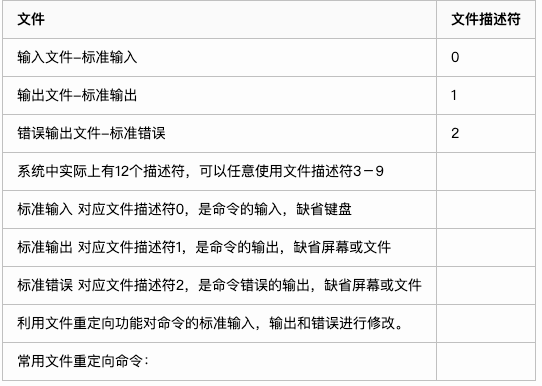
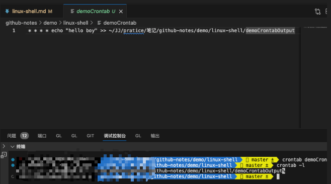
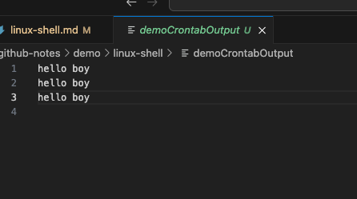
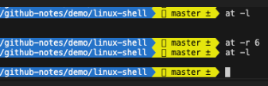
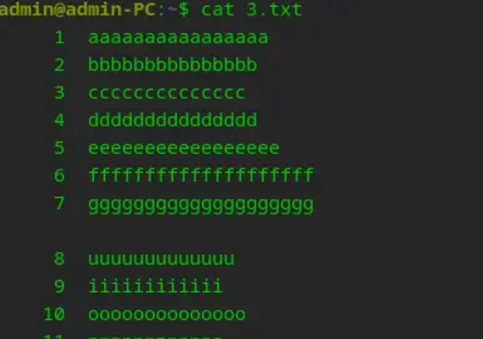
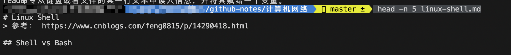
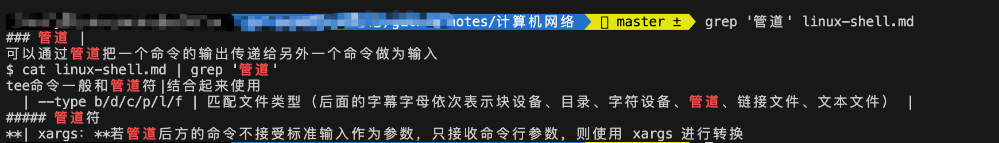

# Linux Shell
> 参考： https://www.cnblogs.com/feng0815/p/14290418.html

## Shell vs Bash

shell是运行在终端中的文本互动程序，bash（GNU Bourne-Again Shell）是最常用的一种shell。是当前大多数Linux发行版的默认Shell。

Shell相当于是一个翻译，把我们在计算机上的操作或我们的命令，翻译为计算机可识别的二进制命令，传递给内核，以便调用计算机硬件执行相关的操作；同时，计算机执行完命令后，再通过Shell翻译成自然语言，呈现在我们面前。

最开始在Unix系统中流行的是sh，而bash作为sh的改进版本，提供了更加丰富的功能。一般来说，都推荐使用bash作为默认的Shell。


## 常见命令

### echo
echo命令可以显示文本行或变量取值，或者把字符串输入到文件中
格式： echo string
echo的常用功能：\c 不换行 \f 不进纸 \t 跳格 \n 换行

note：
对于linux系统，必须使用-e选项来使以上转义符生效

例：
```shell
$ echo  -e  "hello\tboy"
hello	boy
```
echo命令对特殊字符敏感，如果要输出特殊字符，需要用\屏蔽其特殊含义。
常用的特殊字符：双引号"" 反引号`` 反斜线\
例：

```shell
$ echo "\"\""      //想输出""
""
```


### read
read命令从键盘或者文件的某一行文本中读入信息，并将其赋给一个变量。
如果只指定了一个变量，read会把所有的输入赋给该变量，直至遇到第一个文件结束符或回车
格式： read var1 var2 …
例1:
```shell
$ read name
Hello I am superman # 这里是手动输入的内容
$ echo $name
Hello I am superman
```
如果输入的值个数多于变量个数，多余的值会赋给最后一个变量：
例2:
```shell
$ read name surname
John Mike Kate
$ echo $surname   
Mike Kate
$ 
```


### cat

cat可以用来显示文件，并且支持将多个文件串连接后输出

note：该命令一次显示完整个文件，若想分页查看，需使用more

格式： cat [ options ] filename1 … filename2 …
常用options：

- -v 显示控制字符
- -n 对所有输出行进行编号
- -b 与-n相似，但空白行不编号
例：

```shell
$ cat  file1 file2 file3       // 同时显示三个文件
$ cat –b file1 file2 file3
```


### 管道 |
可以通过管道把一个命令的输出传递给另外一个命令做为输入
格式： 命令1 | 命令2
例：

```bash
$ cat linux-shell.md | grep '管道'
```

### tee

把输出的一个副本输送到标准输出，另一个副本拷贝到相应的文件中
如果想看到输出的同时，把输出也同时拷入一个文件，这个命令很合适
格式： `tee -a file`

- -a 表示文件追加到末尾
- file 表示保存输出信息的文件，可自定义文件类型，例如demo.txt
tee命令一般和管道符|结合起来使用
例：

```bash
$ who | tee who.info      // 该命令的信息返回在屏幕上，同时保存在
```
文件who.info中
```bash
$ who | tee who.info
chenshifeng console  Jan  9 12:56 
chenshifeng ttys000  Jan  9 13:27 
chenshifeng ttys004  Jan  9 19:11 
chenshifeng ttys005  Jan 10 00:12 
$ cat who.info 
chenshifeng console  Jan  9 12:56 
chenshifeng ttys000  Jan  9 13:27 
chenshifeng ttys004  Jan  9 19:11 
chenshifeng ttys005  Jan 10 00:12
```


### 标准输入，输出和错误

当我们在shell中执行命令的时候，每个进程都和三个打开的文件相联系，并使用文件描述符来引用这些文件，见下表




  | 符号                   | 作用                                         |
  | ---------------------- | -------------------------------------------- |
  | 命令 < 文件            | 将文件作为命令的标准输入                     |
  | 命令 << 分界符 eg: EOF | 从标准输入中读入，直到遇见分界符才停止       |
  | 命令 < 文件1 > 文件2   | 将文件1作为命令的标准输入并将标准输出到文件2 |

输出重定向（to outside）

  | 符号          | 作用                                                         |
  | ------------- | ------------------------------------------------------------ |
  | 命令 > 文件   | 将标准输出重定向到一个文件中（清空原有文件的数据）           |
  | 命令 2> 文件  | 将错误输出重定向到一个文件中（清空原有文件的数据）           |
  | 命令 >> 文件  | 将标准输出重定向到一个文件中（追加到原有内容的后面）         |
  | 命令 2>> 文件 | 将错误输出重定向到一个文件中（追加到原有内容的后面）         |
  | 命令 &>> 文件 | 将标准输出与错误输出共同写入到文件中（追加到原有内容的后面） |

常用文件重定向命令：
```bash
command > file：                   标准输出重定向到一个文件,错误仍然输出屏幕
command >> file：                  标准输出重定向到一个文件(追加)
command 1> file：                  标准输出重定向到一个文件
command 2>> file：                 标准错误重定向到一个文件(追加) 
command >file 2>&1：               标准输出和标准错误一起重定向到一个文件
command >>file 2>&1：              标准输出和标准错误一起重定向到一个文件(追加)
command < file1 >file2：           以file1做为标准输入，file2做为标准输出
command <file：                    以file做为文件标准输入  
```

\>> 追加就是：在文件内容后面增加内容
\> 就是新建/全文替代

结合使用标准输出和标准错误

```bash
$ cat linux-shell.md 1>myfile.out  2>myerror.out 
```

合并标准输出和标准错误

```bash
$ cat >>mylog.out  2>&1  <hello
```


## shell后台执行命令

### cron
> 使用场景：命令是需要周期性执行的操作或者一个可执行的脚本文件。例如，"*/5 * * * * /usr/local/test.sh"表示每5分钟执行一个名为test.sh的脚本文件。
> 例如：使用crontab每30分钟执行一次ping命令：
*/30 * * * * ping -c 3 http://www.baidu.com

cron是系统的调度进程，可在无人干预的情况下运行作业，通过crontab的命令允许用户提交，编辑或者删除相应的作业。
每个用户都可以有一个crontab文件来保存调度信息，通过该命令运行任意一个shell脚本或者命令
在大的系统中，系统管理员可以通过/etc/cron.allow和/etc/cron.deny这两个文件来禁止或允许用户拥有自己的crontab文件
```
crontab的域
第1列 分钟0～59
第2列 小时0～23(0表示子夜)
第3列 日1～31
第4列 月1～12
第5列 星期0～6(0表示星期天)
第6列 要运行的命令
```

crontab格式： `分<>时<>日<>月<>星期<>要运行的命令`，<>表示空格
如果需要每隔30分钟执行一次命令或任务: `*/30 * * * * command`


note：如果要表示范围的话，如周一到周五，可以用1-5表示
如果要列举某些值,如周一、周五，可以用1,5表示

```
30  21  *  *  *  /apps/bin/cleanup.sh
0,30  18-23  *  *  *  /apps/bin/dbcheck.sh
```


  
1、每隔1分钟执行一次：
```
* * * * * command
```
2、每隔2小时执行一次：
```
0 */2 * * * command
```
3、每日凌晨1点执行一次：
```
0 1 * * * command
```
4、每周日凌晨1点执行一次：
```
0 1 * * 0 command
```
5、每个月的第一天清空日志文件：
0 0 1 * * echo "" > /var/log/mylog.log


crontab的命令选项
格式：`crontab [ -u user ] -e -l -r`
其中
- -u 用户名,如果使用自己的名字登陆，就不用使用-u选项
- -e 编辑crontab文件
- -l 列出crontab文件中的内容
- -r 删除crontab文件

使用方式：
创建一个新的crontab文件
1、创建一个文件，建议名为cron,例shifengcron,在文件中假如如下内容：
```
* * * * * echo "hello boy" >> xxxx/github-notes/demo/linux-shell/demoCrontabOutput
```
每分钟输出"hello boy"


2、此时还没有开始运行，需要调用`crontab -e`才会开始触发
2、当“crontab -e”编辑完成之后，一旦保存退出，那么这个定时任务实际就会写入 /var/spool/cron/ 目录中，每个用户的定时任务用自己的用户名进行区分。
可通过`crontab -l`查看

此时，每过一分钟就会执行了


### at
at命令允许用户向cron守护进程提交作业，使其在稍后的时间运行，这个时间可以是10min以后，也可能是几天以后，但如果时间比较长，建议还是使用crontab
格式：`at [ -f script ] [ -m -l -r ] [ time ] [ date ]`

- -f script 是要提交的脚本或命令
- -m 作业完成后给用户发邮件
- -r 清除某个作业，需要提供作业标识id
- time 作业执行的时间格式可以为：HH. MM ,HH:MM
- H代表小时，M代表分钟
- date 日期格式可以是月份数或日期数，而且at命令可以识别诸如today，tomorrow这样的词

可以通过命令行方式或者at命令提示符方式来提交作业，一般来讲，如果提交多个命令，可以使用at命令提示符；如果提交的是shell脚本，可以使用命令行方式
例：提示符方式：

```bash
$ at 01:15
echo “hello”
echo “boy”  >/home/wuxh/at.log
```
完成后按ctrl+d提交
> note：EOT是Ctrl+D,任务执行后，会给当前用户发送邮件，通过mail命令可以查看相关信息,也可以将信息重定向到文件

`at -l`和`at -r`的使用



### &
当在前台运行某个作业时，终端被该作业占据；而当它在后台运行时，它不会占据终端
可以借助&命令把作业放到后台执行
格式： `命令 &`

注意：
1 .需要用户交互的命令不要放在后台执行，否则机器一直等待
2 .后台程序在执行时，执行结果仍然会输出到屏幕，干扰我们的工作，建议将这样的信息重定向到某个文件

即：`command > out.file 2>&1 &`
将标准输入错误输出都定向到一个out.file的文件中
例：

```bash
$ find /etc/ -name "hello" -print >find.dt 2>&1 &
```
其中2>&1可见[标准输入，输出和错误]

## 引号

### ""双引号/''单引号
可引用除字符\$\,\`,\外的任意字符或者字符串,对$,`,\敏感
单引号和双引号的用法基本类似，不同的是单引号对特殊字符不敏感，可以将其做为普通字符输出出来

```bash
$ echo "`V_V`"  //想输出`V_V`字样    结果得到错误信息
$ echo "\`V_V\`"    //得到`V_V`输出

$ echo '$$'               //结果 $$  不用借助\进行屏蔽
$ echo '`V_V`'          //结果`V_V`,和前面双引号比较

```

### ``反引号
该命令用于设置系统命令的输出到变量，shell将反引号中的内容做为命令执行

```bash
$ echo `hello`
# OUTPUT : -bash: hello: command not found

$ echo `date`
# OUTPUT : 2021年 1月17日 星期日 23时40分18秒 CST

$ echo "The date today is `date`"
The date today is 2021年 1月17日 星期日 23时41分15秒 CST

```

### 反斜线\
果一个字符有特殊含义，为防止shell误解其含义，可用\屏蔽该字符

> 具有特殊含义的字符: & * ^ $ ` “ |


## 变量

### 系统变量

  | 变量名称     | 作用                             |
  | ------------ | -------------------------------- |
  | HOME         | 用户的主目录（即家目录）         |
  | SHELL        | 用户在使用的Shell解释器名称      |
  | HISTSIZE     | 输出的历史命令记录条数           |
  | HISTFILESIZE | 保存的历史命令记录条数           |
  | MAIL         | 邮件保存路径                     |
  | LANG         | 系统语言、语系名称               |
  | RANDOM       | 生成一个随机数字                 |
  | PS1          | Bash解释器的提示符               |
  | PATH         | 定义解释器搜索用户执行命令的路径 |
  | EDITOR       | 用户默认的文本编辑器             |


系统变量适用于所有用户进程，可以在命令行中设置，但用户注销时这些值将丢失，最好在.bash_profile中进行定义，或者/etc/profile
传统上，所有环境变量都大写，且必须用export命令导出

```bash
# 设置环境变量：
var_name=value; export var_name
# 或者：
var_name=value
export var_name
# 又或者# 
export var_name=value
# 查看环境变量：
echo $var_name
```

- `env` 该命令可查看所有系统环境变量
- `unset var_name` 清除系统环境变量

嵌入shell变量
一般来讲，bourne shell有一些预留的环境变量名，这些变量名不能做其他用途，通常在/etc/profile中建立这些嵌入的环境变量，但这不绝对，取决于用户
shell的变量列表：
`CDPATH; EXINIT; HOME; IFS; LOGNAME; MAIL;MAILCHECK; PATH; PS1; PS2; SHELL; TERMINFO;TERM; TZ`

### 用户变量
在用户shell生命周期的脚本中使用，不同的用户可以定义各自的用户变量 ~/.bashrc
```
var_name=value
```
==!!!注意变量=两边不能有空格==

```bash
testVar=23
# OK
testVar = 23
# OUTPUT: command not found: testVar
```


使用
```bash
echo $var_name
or  echo ${var_name}   //建议使用
```
清除变量：
```bash
unset var_name
```

显示用户所有变量：`set`
测试变量是否设置：`echo ${var:=value}` 若未设置或未初始化，可用新值

使用变量保存系统命令参数
例：

```bash
$ SOURCE="/etc/passwd"
$ DEST="/home/chenshifeng/
$ cp $SOURCE $DEST	
```

设置只读变量
可设置某个变量为只读方式，只读变量不可更改，否则系统返回错误
用法：

```bash
var_name=value
readonly var_name  
``` 

### 位置变量
位置变量属于只读变量
作用：向shell脚本传递参数，参数个数可以任意多，但只有前9个被访问到，shift命令可以更改这个限制。
每个访问参数前加$，
第一个参数为0，表示预留保存实际脚本名字，无论脚本是否有参数，此值均可用,如：给脚本test传递信息：
例如：Would you like to do it


例：$ vi test

```bash
#!/bin/sh
echo "The full name is : $0 "
echo "The script name is : `basename $0`"
echo "The first parameter is :$1"
echo "The second parameter is :$2"
echo "The third parameter is :$3"
echo "The fourth parameter is :$4"
echo "The fifth parameter is :$5"
echo "The sixth parameter is :$6"
echo "The seventh parameter is :$7"
echo "The eighth parameter is :$8"
echo "The ninth parameter is :$9"
```
保存文件，执行 `$ ./test would you like to do it`

```bash
The full name is : ./test 
The script name is : test
The first parameter is :would
The second parameter is :you
The third parameter is :like
The fourth parameter is :to
The fifth parameter is :do
The sixth parameter is :it
The seventh parameter is :
The eighth parameter is :
The ninth parameter is :
```

> note：上例中$0返回的信息中包含路径名，如果只想得到脚本名称，可以借助basename,将脚本中第一句修改为：
echo "The script name is : \`basename \$0\` "
保存文件，执行 ./test would you like to do it

> note：basename 用``向系统命令传递参数

可以在脚本中向系统命令传递参数

```
$ vi findfile
#!/bin/sh
find / -name  $1
```


保存，执行

```bash
$ ./findfile  passwd
```

相当于执行了：
```bash
find / -name passwd
```

// demoParam.sh
```bash
echo "hello"
echo "filename:$0"
echo "last result:$?"
echo "all parameters:$*"
echo "all parameters:$@"
echo "count parameters:$#"
echo "pid:$$"
echo "first para:$1"
echo "second para:$2"
```

若执行` ./demoEcho.sh`
报错：`OUTPUT: permission denied: ./demoEcho.sh`

可：修改文件权限：所有用户添加执行权限
`chmod a+x demoEcho.sh`


执行：
```bash
./demoEcho.sh param1 param2 param3`
```

结果：
```
hello
filename:./demoEcho.sh
last result:0
all parameters:param1 param2 param3
all parameters:param1 param2 param3
count parameters:3
pid:33810
first para:param1
second para:param2
```


### 特定变量
特定变量属于只读变量，反映脚本运行过程中的控制信息
特定的shell变量列表：


\$# / $* 见上面的例子


### 设置默认变量

#### ${var:-default}

var为空，用default作为返回值。
var不会被设置，**不改变var值**。
var不为空，返回var的值。

```bash
$ echo ${msg}

$ echo ${msg:-hello}
hello
$ echo ${msg}
```

#### ${var:+default}

var为空，无操作。
var不为空，返回值default。**不改变var值**。
相当于`${var:-default}`取反？

```bash
$ unset msg
$ echo $msg

$ echo ${msg:+world}

$ msg=hello
$ echo $msg
hello
$ echo ${msg:+world}
world
$ echo $msg
```


#### ${var:=default}
var为空，返回值default，同时，设置var值为default，**var被修改**。
var不为空，返回var的值，不会修改。

```bash
$ echo $msg

$ echo ${msg:=hello}
hello
$ echo ${msg}
hello
$ echo ${msg:=world}
hello
```

#### ${var:?error_message}
var为空，打印错误提示error_message。
var不为空，返回var值。

```bash
$ echo ${msg}
# OUTPUT： hello
$ echo ${msg?'Error: msg is not set! '}
# OUTPUT： hello
$ echo ${message}

$ echo ${message?'Error: message is not set! '}
# OUTPUT： bash: message: Error: message is not set! 
```

在bash中，中间的’:'可以省略。

### 用户变量可用来自定义命令行缩写
例如可以创建命令行的简写：
```
alias ga='git add .'
alias gpull='git pull'
alias gpush='git push'
alias gm='git merge'
alias gp-rb='git pull --rebase'
alias gc='git commit -m '
alias gc-nf='git commit -m --no-ff'
alias gch='git checkout'
alias gch-b='git checkout -b'
alias glog='git log'
alias gb='git branch'
alias gb-a='git branch -a'
alias gb-D='git branch -D'
alias gpo-D='git push origin --delete'
alias gpo='git push origin'
```
此时，在命令行输入`ga`实际是调用了`git add .`


## 运算

### if else
```
if [ command ];then
符合该条件执行的语句
elif [ command ];then
符合该条件执行的语句
else
符合该条件执行的语句
fi
```

==注意 if [ 1 -eq 1 ] []前后必须要空格==
### 数值运算符

注意：数值运算符只是针对数值的比较，如果用来比较的是字符或者字符串则会返回报错“ integer expression expected”
```
-eq 等于则为真，如果是对整数进行比较相当于“=”

-ne 不等于则为真，如果是对整数进行比较相当于“!=”

-gt 大于则为真,如果是对整数进行比较相当于“>”

-ge 大于等于则为真,如果是对整数进行比较相当于“>=”

-lt 小于则为真,如果是对整数进行比较相当于“<”

-le 小于等于则为真,如果是对整数进行比较相当于“<=”
```


```bash
if [ 1 -eq 1 ]; then
  echo 'eq 1=1'
fi

if [ 1 -lt 2 ]; then
  echo 'lt 1<2'
fi
```

### 字符串比较符
```
=：字符串包含的文本是否一样

== 两个字符串是否相等

>:比较字母的大小，比如var1 > var2,如果var1字母大于var2则返回真

<:和大于相反

!= 两个字符串不相等

-z 空字符串

-n 非空字符串
```


## 常见命令

### 系统状态


+ **ps**

  **pstree**

  | 参数 | 作用                               |
  | ---- | ---------------------------------- |
  | -a   | 显示所有进程（包括其他用户的进程） |
  | -u   | 用户以及其他详细信息               |
  | -x   | 显示没有控制终端的进程             |

  > **R（运行）：**进程正在运行或在运行队列中等待。
  >
  > **S（中断）：**进程处于休眠中，当某个条件形成后或者接收到信号时，则脱离该状态。
  >
  > **D（不可中断）：**进程不响应系统异步信号，即便用kill命令也不能将其中断。
  >
  > **Z（僵死）：**进程已经终止，但进程描述符依然存在, 直到父进程调用wait4()系统函数后将进程释放。
  >
  > **T（停止）：**进程收到停止信号后停止运行。
  >
  > 高优先级（<），低优先级（N），被锁进内存（L），包含子进程（s），多线程（l）

+ **top**

  > 第1行：系统时间、运行时间、登录终端数、系统负载（三个数值分别为1分钟、5分钟、15分钟内的平均值，数值越小意味着负载越低）。
  >
  > 第2行：进程总数、运行中的进程数、睡眠中的进程数、停止的进程数、僵死的进程数。
  >
  > 第3行：用户占用资源百分比、系统内核占用资源百分比、改变过优先级的进程资源百分比、空闲的资源百分比等。其中数据均为CPU数据并以百分比格式显示，例如“99.9 id”意味着有99.9%的CPU处理器资源处于空闲。
  >
  > 第4行：物理内存总量、内存空闲量、内存使用量、作为内核缓存的内存量。
  >
  > 第5行：虚拟内存总量、虚拟内存空闲量、虚拟内存使用量、已被提前加载的内存量。

+ **kill**：用于终止某个指定PID值的服务进程。kill [参数] 进程的PID

  **killall**：用于终止某个指定名称的服务所对应的全部进程。killall [参数] 服务名称

+ **ifconfig**：用于获取网卡配置与网络状态等信息

  ``` shell
  # 主要看：网卡名称、inet参数的IP地址、ether参数的MAC地址、RX、TX流量统计
  ens160: flags=4163<UP,BROADCAST,RUNNING,MULTICAST>  mtu 1500
          inet 192.168.10.10  netmask 255.255.255.0  broadcast 192.168.10.255
          inet6 fe80::c8f8:f5c5:8251:aeaa  prefixlen 64  scopeid 0x20
          ether 00:0c:29:7d:27:bf  txqueuelen 1000  (Ethernet)
          RX packets 304  bytes 33283 (32.5 KiB)
          RX errors 0  dropped 0  overruns 0  frame 0
          TX packets 91  bytes 11052 (10.7 KiB)
          TX errors 0  dropped 0 overruns 0  carrier 0  collisions 0
  ```

+ **who**：用于查看当前登入主机的用户终端信息

  **last**：用于调取主机的被访记录

+ **ping**

+ **netstat**：netstat -antupl

  | 参数 | 说明                     |
  | ---- | ------------------------ |
  | -a   | 显示所有连接中的Socket   |
  | -p   | 显示正在使用的进程信息   |
  | -t   | 显示TCP协议的连接状态    |
  | -u   | 显示UDP协议的连接状态    |
  | -n   | 使用IP地址，不使用域名   |
  | -l   | 仅列出正在监听的服务状态 |
  | -i   | 现在网卡列表信息         |
  | -r   | 显示路由表信息           |

+ **telnet**：telnet ip port

### 文件操作
> 参考：https://zhuanlan.zhihu.com/p/623270535

+ **pwd**

+ **cd**

+ **ls**：ls -al

  **tree**：用于以树状图的形式列出目录内容及结构

+ **find**：用于按照指定条件来查找文件所对应的位置。find [查找范围] 寻找条件  eg：find / -name "hello"

  | 参数               | 作用                                                         |
  | ------------------ | ------------------------------------------------------------ |
  | -name              | 匹配名称                                                     |
  | -perm              | 匹配权限（mode为完全匹配，-mode为包含即可）                  |
  | -user              | 匹配所有者                                                   |
  | -group             | 匹配所有组                                                   |
  | -mtime -n +n       | 匹配修改内容的时间（-n指n天以内，+n指n天以前）               |
  | -atime -n +n       | 匹配访问文件的时间（-n指n天以内，+n指n天以前）               |
  | -ctime -n +n       | 匹配修改文件权限的时间（-n指n天以内，+n指n天以前）           |
  | -nouser            | 匹配无所有者的文件                                           |
  | -nogroup           | 匹配无所有组的文件                                           |
  | -newer f1 !f2      | 匹配比文件f1新但比f2旧的文件                                 |
  | --type b/d/c/p/l/f | 匹配文件类型（后面的字幕字母依次表示块设备、目录、字符设备、管道、链接文件、文本文件） |
  | -size              | 匹配文件的大小（+50KB为查找超过50KB的文件，而-50KB为查找小于50KB的文件） |
  | -prune             | 忽略某个目录                                                 |
  
+ **cat**：cat查看文件内部的内容
-n 可显示行号
```bash
cat -n linux-shell.md
```

```bash
cat -b 1.txt 2.txt >> 3.txt
```
cat -b命令把两个没有行号的文件合成一个文件并加上行号


```bash
cat /dev/null > 3.txt
```
意思就是把此文件内容丢进一个设备，也叫黑洞

+ **more**：space / enter 向下翻页
more 命令类似 cat ，不过会以一页一页的形式显示，更方便使用者逐页阅读，而最基本的指令就是按空白键（space）就往下一页显示，按 b 键就会往回（back）一页显示。

+ **head**：head -n 10 log
head命令很简单就是显示一个文件的头部几行，但我们要结合参数-n使用

例如：
```bash
head -n 5 linux-shell.md
```
意思就是显示次文件的前5行，如图：


+ **tail**：tail -n 10 log

tail命令刚好有点和head命令相反，如果不加参数的情况下，默认是查看文件的最后10行，我们可以用于查看一直在变化的日志文件，这样可以查看最新产生的10行内容。

当然也可以查看从第几行到最后一行，例如:`tail -n +30 xx.log` 意思就是查看文件第30行到最后一样。

如果想查看字符的话可以使用命令例如：`tail -c 20 xx.log`意思就是查看文件最后20个字符。


+ **wc**：用于统计指定字符串的行数、字数或字节数

  | 参数 | 作用         |
  | ---- | ------------ |
  | -l   | 只显示行数   |
  | -w   | 只显示单词数 |
  | -c   | 只显示字节数 |

+ **cut**：用于按列提取字符串内容   cut -d : -f 1 /etc/passwd

  | 参数 | 作用                   |
  | ---- | ---------------------- |
  | -f   | 设置需要提取的列的下标 |
  | -d   | 设置间隔符号           |

+ **grep**：输出符合查询条件的行   grep  "warn"  a.log 

  | 参数 | 作用                               |
  | ---- | ---------------------------------- |
  | -n   | 显示行号                           |
  | -v   | 反向选择——仅列出没有“关键词”的行。 |

grep (global regular expression) 命令用于查找文件里符合条件的字符串或正则表达式。

例如我们想在文件中查找“管道”可以：

```bash
grep '管道' linux-shell.md
```


+ **awk**：读取文件的每一行，输出里面的字段

  ``` shell
  # 格式
  $ awk 动作 文件名
  # 示例
  $ awk '{print $0}' demo.txt
  ```

  + 分隔符 -F（默认空格）

    ``` shell
    $ awk -F ':' '{ print $1 }' demo.txt
    # $O 代表输入行，$1、$2、$3 代表第一个字段、第二个字段、第三个字段
    ```

  + 变量 $N

    ``` shell
    # $NF 代表最后一个字段
    $ echo 'this is a test' | awk '{print $NF}'
    test
    # NR 代表当前处理的是第几行
    $ awk -F ':' '{print NR ") " $1}' demo.txt
    1) root
    2) daemon
    ```

  + 条件：只输出符合条件的行

    ``` shell
    # 格式
    $ awk '条件 动作' 文件名
    # 示例
    $ awk -F ':' '/usr/ {print $1}' demo.txt   # /regx/ 正则
    $ awk -F ':' 'NR % 2 == 1 {print $1}' demo.txt
    $ awk -F ':' '{if ($1 > "m") print $1}' demo.txt
    ```

+ **touch**

  **mkdir**

  **cp**

  **mv**

  **rm**

+ **tar**

  ```shell
  tar -czvf a.tar.gz ./dir
  tar -xzvf a.tar.gz -C ./
  ```

  | 参数 | 作用                   |
  | ---- | ---------------------- |
  | -c   | 创建压缩文件           |
  | -x   | 解开压缩文件           |
  | -t   | 查看压缩包内有哪些文件 |
  | -z   | 用Gzip压缩或解压       |
  | -j   | 用bzip2压缩或解压      |
  | -v   | 显示压缩或解压的过程   |
  | -f   | 目标文件名             |
  | -p   | 保留原始的权限与属性   |
  | -P   | 使用绝对路径来压缩     |
  | -C   | 指定解压到的目录       |

+ **ln**：用于创建文件的软硬链接

  ``` shell
  ln old.txt new.txt
  -rw-r--r-- 2 root root 26 Jan 11 00:13 old.txt
  # 文件属性第二列的数字是文件inode链接数，创建硬链接则加一
  ```

  | 参数 | 作用                                               |
  | ---- | -------------------------------------------------- |
  | -s   | 创建“符号链接”（如果不带-s参数，则默认创建硬链接） |
  | -f   | 强制创建文件或目录的链接                           |
  | -i   | 覆盖前先询问                                       |
  | -v   | 显示创建链接的过程                                 |


##### 输入输出

> 标准输入重定向（STDIN，文件描述符为0）：默认从键盘输入，也可从其他文件或命令中输入。
>
> 标准输出重定向（STDOUT，文件描述符为1）：默认输出到屏幕。
>
> 错误输出重定向（STDERR，文件描述符为2）：默认输出到屏幕。

+ 输入重定向（to memery）


##### 管道符

**|：**把前一个命令原本要输出到屏幕的信息当作是后一个命令的标准输入

**| xargs：**若管道后方的命令不接受标准输入作为参数，只接收命令行参数，则使用 xargs 进行转换


##### Shell

+ ``` shell
  #!/bin/bash
  echo $0 # 文件名
  echo $1 # 第一个传参
  ```

+ **变量**

  ``` shell
  VAR=VALUE
  VAR=$(curl www.baidu.com)
  echo "$VAR"
  echo "${VAR}"
  ```

+ **数组**

  ``` shell
  ARRAY=(VALUE0 VALUE1 VALUE2 VALUE3)
  ARRAY[0]=VALUE0
  ARRAY[1]=VALUE1
  echo ${ARRAY[0]}
  echo ${ARRAY[*]} # 所有元素
  echo ${#ARRAY[*]} # 数组长度
  for item in ${ARRAY[*]}; do echo $item; done
  ```

+ **expr**

  ``` shell
  VAL=`expr $a + $b`
  VAR=`expr $a - $b`
  VAR=`expr $a \* $b`
  VAR=`expr $a / $b`
  ```

+ **if**

  ``` shell
  if [ $VAR == 1 ]; then echo "+"; echo "-"; 
  elif [ $VAR == 2 ]; then echo "/"; 
  else echo "*"; fi
  ```

+ **for**

  ``` shell
  for i in $(ls); do echo $i; done
  ```

+ **while**

  ```shell
  while [ 1 == 1 ]; do echo "+"; done
  ```


##### 用户管理

在Linux系统中创建每个用户时，将自动创建一个与其同名的基本用户组，而且这个基本用户组只有该用户一个人。如果该用户以后被归纳入其他用户组，则这个其他用户组称之为扩展用户组。一个用户只有一个基本用户组，但是可以有多个扩展用户组

+ **id**：用于显示用户详细信息。id root

+ **useradd**：用于创建新的用户账户。

  | 参数 | 作用                                     |
  | ---- | ---------------------------------------- |
  | -d   | 指定用户的家目录（默认为/home/username） |
  | -e   | 账户的到期时间，格式为YYYY-MM-DD.        |
  | -u   | 指定该用户的默认UID                      |
  | -g   | 指定一个初始的用户基本组（必须已存在）   |
  | -G   | 指定一个或多个扩展用户组                 |
  | -N   | 不创建与用户同名的基本用户组             |
  | -s   | 指定该用户的默认Shell解释器              |

+ **groupadd**：用于创建新的用户组

+ **usermod**：用于修改用户的属性

  | 参数  | 作用                                                         |
  | ----- | ------------------------------------------------------------ |
  | -c    | 填写用户账户的备注信息                                       |
  | -d -m | 参数-m与参数-d连用，可重新指定用户的家目录并自动把旧的数据转移过去 |
  | -e    | 账户的到期时间，格式为YYYY-MM-DD                             |
  | -g    | 变更所属用户组                                               |
  | -G    | 变更扩展用户组                                               |
  | -L    | 锁定用户禁止其登录系统                                       |
  | -U    | 解锁用户，允许其登录系统                                     |
  | -s    | 变更默认终端                                                 |
  | -u    | 修改用户的UID                                                |

+ **passwd**：用于修改用户的密码、过期时间等信息。

  普通用户只能使用passwd命令修改自己的系统密码，而root管理员则有权限修改其他所有人的密码（而且不用验证旧密码）

  | 参数    | 作用                                                         |
  | ------- | ------------------------------------------------------------ |
  | -l      | 锁定用户，禁止其登录                                         |
  | -u      | 解除锁定，允许用户登录                                       |
  | --stdin | 允许通过标准输入修改用户密码，如echo "NewPassWord" \| passwd --stdin Username |
  | -d      | 使该用户可用空密码登录系统                                   |
  | -e      | 强制用户在下次登录时修改密码                                 |
  | -S      | 显示用户的密码是否被锁定，以及密码所采用的加密算法名称       |

+ **userdel**：用于删除已有的用户账户

  | 参数 | 作用                     |
  | ---- | ------------------------ |
  | -f   | 强制删除用户             |
  | -r   | 同时删除用户及用户家目录 |


##### 权限管理

+ **普通权限**：读 写 执行 【所属者 所属组 其它用户】

+ **chmod**：用于设置文件的一般权限及特殊权限。[u g o] [+ -] [r w x s t]

  | 参数 | 作用         |
  | ---- | ------------ |
  | u+s  | 设置SUID权限 |
  | u-s  | 取消SUID权限 |
  | g+s  | 设置SGID权限 |
  | g-s  | 取消SGID权限 |
  | o+t  | 设置SBIT权限 |
  | o-t  | 取消SBIT权限 |

  **chown**：用于设置文件的所有者和所有组

  ``` shell
  chown user:group anaconda-ks.cfg 
  ```

  

+ **隐藏权限**

  **chattr**：用于设置文件的隐藏权限

  **lsattr**：用于查看文件的隐藏权限

  | 参数 | 作用                                                         |
  | ---- | ------------------------------------------------------------ |
  | i    | 无法对文件进行修改；若对目录设置了该参数，则仅能修改其中的子文件内容而不能新建或删除文件 |
  | a    | 仅允许补充（追加）内容，无法覆盖/删除内容（Append Only）     |
  | S    | 文件内容在变更后立即同步到硬盘（sync）                       |
  | s    | 彻底从硬盘中删除，不可恢复（用0填充原文件所在硬盘区域）      |

+ **su** / **sudo -i**

##### 目录结构

| 目录名称    | 应放置文件的内容                                          |
| ----------- | --------------------------------------------------------- |
| /boot       | 开机所需文件—内核、开机菜单以及所需配置文件等             |
| /dev        | 以文件形式存放任何设备与接口                              |
| /etc        | 配置文件                                                  |
| /home       | 用户主目录                                                |
| /bin        | 存放单用户模式下还可以操作的命令                          |
| /lib        | 开机时用到的函数库，以及/bin与/sbin下面的命令要调用的函数 |
| /sbin       | 开机过程中需要的命令                                      |
| /media      | 用于挂载设备文件的目录                                    |
| /opt        | 放置第三方的软件                                          |
| /root       | 系统管理员的家目录                                        |
| /srv        | 一些网络服务的数据文件目录                                |
| /tmp        | 任何人均可使用的“共享”临时目录                            |
| /proc       | 虚拟文件系统，例如系统内核、进程、外部设备及网络状态等    |
| /usr/local  | 用户自行安装的软件                                        |
| /usr/sbin   | Linux系统开机时不会使用到的软件/命令/脚本                 |
| /usr/share  | 帮助与说明文件，也可放置共享文件                          |
| /var        | 主要存放经常变化的文件，如日志                            |
| /lost+found | 当文件系统发生错误时，将一些丢失的文件片段存放在这里      |

