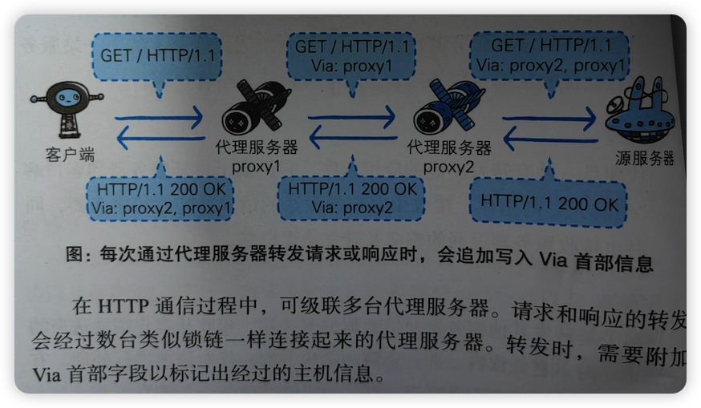

# 计算机网络

## HTTP
### HTTP状态码
**1xx 接收的请求正在处理**

- **100**：Continue，服务器收到了请求的初始部分，并且请客户端继续发送。比如，客户端有大文件需要上传，但是服务器是否愿意接受，所以希望在消耗网络资源进行传输之前，先询问一下服务器的意愿（故是一种优化）。
（Req-Header）Expect: 100-continue   （Res-Status）100 Continue    417 Expectation Failed

- **101**：Switching Protocols，切换协议 
（Req-Res-Header）Connection: Upgrade，  Upgrade: websocket

**2xx 请求正常处理完毕**
- **204**：处理成功，但无资源可返回
- **206**：结合Content-Range指定范围的实体内容使用。客户端：我只想要其中一部分；服务端：是对资源某一部分的请求。

**3xx 重定向**
- **301**：【结合Location，指明重定向的url】代表永久重定向，也就是说第一次请求拿到长链接后，下次浏览器再去请求短链的话，不会向短网址服务器请求了，而是直接从浏览器的缓存里拿，这样在 server 层面就无法获取到短网址的点击数了，如果这个链接刚好是某个活动的链接，也就无法分析此活动的效果。所以我们一般不采用 301
- **302**：【结合Location，指明重定向的url】代表临时重定向，也就是说每次去请求短链都会去请求短网址服务器（除非响应中用 Cache-Control 或 Expired 暗示浏览器缓存），这样就便于 server 统计点击数，所以虽然用 302 会给 server 增加一点压力，但在数据异常重要的今天，这点代码是值得的，所以推荐使用 302
- **304**：和重定向无关，资源缓存相关
> **304**
第一次请求
> + step1:  (res) 200 --> date、expires、Last-Modified、ETag
第二次请求
> + step1: 看是否需要发送请求 （查缓存，先 from memory cache 再 from disk cache）
>   + (req) cache-control：max-age=xxx 
    + 先比较当前时间和上次响应 date，如果没有超过max-age，命中本地强缓存
    + 如果没有cache-control，则取服务端 expires 的值，来对比当前时间是否过期
    + 如果都不满足，则进入协商缓存阶段（此时才需要发送请求）
>   + (req) cache-control：no-cache （直接进入协商缓存步骤）
> + step2:  协商缓存（服务端没修改资源，没必要回传）
>   + (req) If-Modified-Since: Last-Modified 该请求首部告诉服务器，如果客户端传来的最后修改时间与服务器上的一致，则直接回送 304 和 响应报头即可
>   + (req) If-None-Match: ETag-value （解决 La st-Modified 的缺陷：一个资源被修改了，但其实际内容根本没发生改变，故采用哈希标志）若服务端与客户端一致，则直接回送 304 和 响应报头即可 

**4xx 客户端请求错误码**
- **400**：一般为接口请求参数问题
- **401**：一般为认证失败
- **403**：一般为没有权限
  
**5xx 服务端请求错误码**
- **500**：
- **503**：表示服务器暂时处于超负荷或正在进行停机维护，现在无法处理请求。

### HTTP头部
**头部的Authorization 和 cookie**
参考链接：https://zhuanlan.zhihu.com/p/651237145?utm_id=0

1、将 token 放在 cookie 里
前端可完全不写代码，设置 cookie 可依赖后端的 Set-Cookie 响应头，同域名情况下发送所有请求的时候 cookie 也是自动带上。

坏处
造成网络流量和带宽的浪费，所以 CDN 的域名都是和主站不同的，避免请求带上 cookie 浪费流量。

安全性
cookie 可设置 HttpOnly 来保护 cookie 无法被 JS 代码捕获，避免 XSS 等攻击，还可设置 Secure 来确保只在 https 环境下传输 token；这些能力由浏览器提供，Authorization 无法实现。

但cookie存在 CSRF 攻击的问题，虽然浏览器厂商在逐步禁止第三方 cookie（似乎推迟到 2024 年了），但这问题还是不得不防（如想使用第三方 cookie，可在后端响应中设置 cookie 的 SameSite 属性）；

在一级域名相同时，cookie可实现跨子域名互通，如
a.example.com；b.example.com

之间可实现 cookie 互通（设置 cookie 时提供 Domain=example.com 属性），这能力 Authorization 也不具备。

网页的图片 \ 请求时也会自动带上 cookie：

好处，便于控制网络图片的访问权限，如网络相册的权限控制可以精确到用户级，Authorization做不到，它须把 token 放在 url 查询里面

缺点：如网页中的背景图、icon 等资源图片放在相同域名下，每次请求这些资源图片都会带上 cookie，浪费带宽和服务器的流量， 所以 CDN 域名要和主域名区分开

2、将 token 放在请求头里，用 Authorization 字段：
此字段需由 JS 代码写入，请求想要带上 Authorization 字段，则需用 JS 代码给请求方法添加全局拦截器，因此它天生具备防止 CSRF 的功能。

只有浏览器使用 cookie，而 Node.js 等环境没有 cookie 的（现在小程序也可支持 cookie），只能使用 Authorization；因为此字段完全由 JS 操作；虽然它原生没有提供 cookie 的 Secure、Expires 等功能，但可通过 JS 代码自行实现。

前端将 token 持久存储，一般存储在 LocalStorage，此时存在 XSS 攻击盗取 token 问题（将 LocalStorage 里的 token 加密可一定避免），而且它无法跨域互通，即使两个网站的一级域名相同也无法互通。

3、认证规范要求
必须使用 Authorization 字段，如 JWT，如使用相关认证（尤其是第三方服务），则必须使用此字段。

## 代理、网关、防火墙
### 代理

代理/网关请求过程，各个代理服务器会往Via首部添加自身服务器的信息，是为了追踪客户端与服务端之间的请求和相应的传输路径，见下：（From 图解HTTP）
 