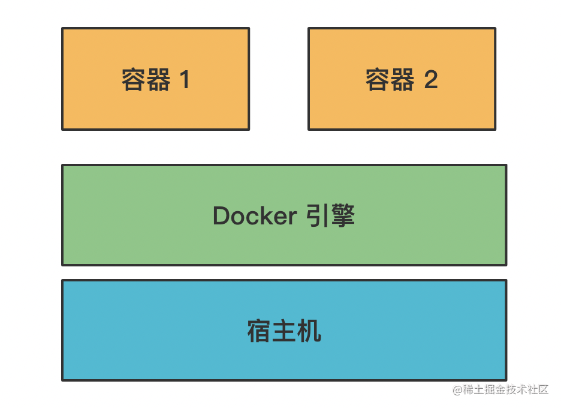

# docker
> 学习/参考链接：
> [docker入门，这一篇就够了。](https://blog.csdn.net/m0_61503020/article/details/125456520)
> [Docker 是怎么实现的？前端怎么用 Docker 做部署？](https://mp.weixin.qq.com/s/qShEqZcn903fWDxnj1KKQA)

## WHAT
### 什么是docker
代码开发完之后，要经过构建，把产物部署到服务器上跑起来，这样才能被用户访问到。

不同的代码需要不同的环境，比如 JS 代码的构建需要 node 环境，Java 代码 需要 JVM 环境，一般我们会把它们隔离开来单独部署。

现在一台物理主机的性能是很高的，完全可以同时跑很多个服务，而我们又有环境隔离的需求，所以会用虚拟化技术把一台物理主机变为多台虚拟主机来用。

现在主流的虚拟化技术就是 docker 了，它是基于容器的虚拟化技术。

它可以在一台机器上跑多个容器，每个容器都有独立的操作系统环境，比如文件系统、网络端口等。

### 那它是怎么实现的这种隔离的容器呢？
这就依赖操作系统的机制了：

linix 提供了一种叫 namespace 的机制，可以给进程、用户、网络等分配一个命名空间，这个命名空间下的资源都是独立命名的。

比如 PID namespace，也就是进程的命名空间，它会使命名空间内的这个进程 id 变为 1，而 linux 的初始进程的 id 就是 1，所以这个命名空间内它就是所有进程的父进程了。

而 IPC namespace 能限制只有这个 namespace 内的进程可以相互通信，不能和 namespace 外的进程通信。

Mount namespace 会创建一个新的文件系统，namespace 内的文件访问都是在这个文件系统之上。

类似这样的 namespace 一共有 6 种：

PID namespace：进程 id 的命名空间
IPC namespace：进程通信的命名空间
Mount namespace：文件系统挂载的命名空间
Network namespace：网络的命名空间
User namespace：用户和用户组的命名空间
UTS namespace：主机名和域名的命名空间
通过这 6 种命名空间，Docker 就实现了资源的隔离。
但是只有命名空间的隔离还不够，这样还是有问题的，比如如果一个容器占用了太多的资源，那就会导致别的容器受影响。

怎么能限制容器的资源访问呢？

这就需要 linux 操作系统的另一种机制：Control Group。

创建一个 Control Group 可以给它指定参数，比如 cpu 用多少、内存用多少、磁盘用多少，然后加到这个组里的进程就会受到这个限制。

这样，创建容器的时候先创建一个 Control Group，指定资源的限制，然后把容器进程加到这个 Control Group 里，就不会有容器占用过多资源的问题了。

那这样就完美了么？

其实还有一个问题：每个容器都是独立的文件系统，相互独立，而这些文件系统之间可能很大部分都是一样的，同样的内容占据了很大的磁盘空间，会导致浪费。

那怎么解决这个问题呢？

Docker 设计了一种分层机制：

每一层都是不可修改的，也叫做镜像。那要修改怎么办呢？

会创建一个新的层，在这一层做修改

然后通过一种叫做 UnionFS 的机制把这些层合并起来，变成一个文件系统

这样如果有多个容器内做了文件修改，只要创建不同的层即可，底层的基础镜像是一样的。

Docker 通过这种分层的镜像存储，写时复制的机制，极大的减少了文件系统的磁盘占用。

而且这种镜像是可以复用的，上传到镜像仓库，别人拉下来也可以直接用。

比如下面这张 Docker 架构图：

docker 文件系统的内容是通过镜像的方式存储的，可以上传到 registry 仓库。docker pull 拉下来之后经过 docker run 就可以跑起来。

这里简单给大家介绍一下docker的工作流程。
工作流程：
1、启动docker
2、下载镜像到本地
3、启动docker容器实例

回顾一下 Docker 实现原理的三大基础技术：

Namespace：实现各种资源的隔离
Control Group：实现容器进程的资源访问限制
UnionFS：实现容器文件系统的分层存储，写时复制，镜像合并
都是缺一不可的。

### Docker特性
文件系统隔离：每个进程容器运行在一个完全独立的根文件系统里。

资源隔离：系统资源，像CPU和内存等可以分配到不同的容器中，使用cgroup。
网络隔离：每个进程容器运行在自己的网路空间，虚拟接口和IP地址。

日志记录：Docker将收集到和记录的每个进程容器的标准流（stdout/stderr/stdin），用于实时检索或者批量检索

变更管理：容器文件系统的变更可以提交到新的镜像中，并可重复使用以创建更多的容器。无需使用模板或者手动配置。

交互式shell：Docker可以分配一个虚拟终端并且关联到任何容器的标准输出上，例如运行一个一次性交互shell。

### Docker局限性
Docker用于应用程序时是最有用的，但并不包含数据。日志、数据库等通常放在Docker容器外。一个容器的镜像通常都很小，不用和存储大量数据，存储可以通过外部挂载等方式使用，比如：NFS、ipsan、MFS等 ，或者docker命令 ，-v映射磁盘分区。
总之，docker只用于计算，存储交给别人。

## HOW
